# Elastic Search

Elastic Search是一个强大的开源搜索引擎，可以从海量的数据中心快速找到需要的内容。

以Elastic Search为核心，结合Kibana、Logstash和Beats构成了Elastic Stack（ELK），广泛地应用于日志数据分析、实时监控等领域。

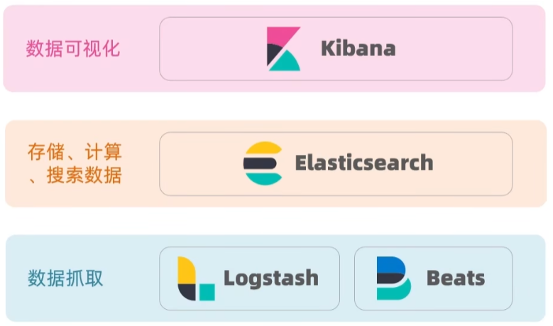

Elastic Search是基于Apache的Lucene开发的，Lucene是一个易扩展、高性能（基于倒排索引）的搜索引擎类库，尽管它只支持Java语言，并且学习路线陡峭，但是很多定制搜索引擎都需要围绕它来创建。而基于其开发的ES则有着这些优势：支持分布式，可水平扩展，提供Restful接口，可以被任何语言调用。

### 倒排索引

传统数据库例如MySQL采用正向索引。正向索引为每条数据的主键id建立索引，这种索引在根据id查找时效率很高，但是对于模糊查询则失效，模糊查询会顺序查找每一条数据，跟数据内容进行比对观察是否和模糊查询字段匹配，因此效率极低。

Elastic Search则采用倒排索引。其中每一条数据被称为文档document，文档会根据语义划分为多个词语，称为词条term。倒排索引在维护文档时，会为文档分词出多个term，为每个term建立索引，每一个term可能会对应多个文档id，文档id能够查询到对应的文档，其中term应该是唯一的。

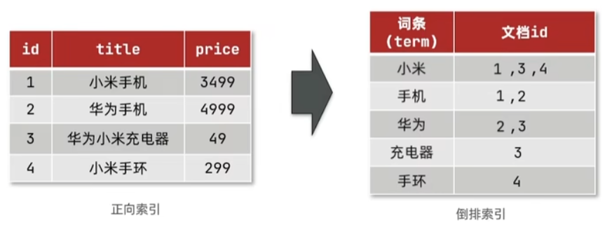

倒排索引在模糊查询时，会根据模糊查询字段去搜索包含字段的term，找出所有符合的文档。

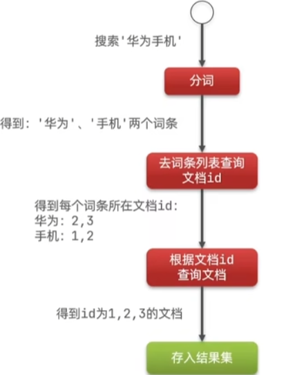

### 相关名词和概念

#### 文档document

Elastic Search是面向文档存储的，相当于数据库中的一条数据。

不同的是文档数据是被序列化成Json格式存储在ES中的。

#### 索引index

相同类型的文档的集合，类似于数据库中的表。

#### 映射Mapping

索引中文档的字段约束信息，类似于数据库中的表结构。

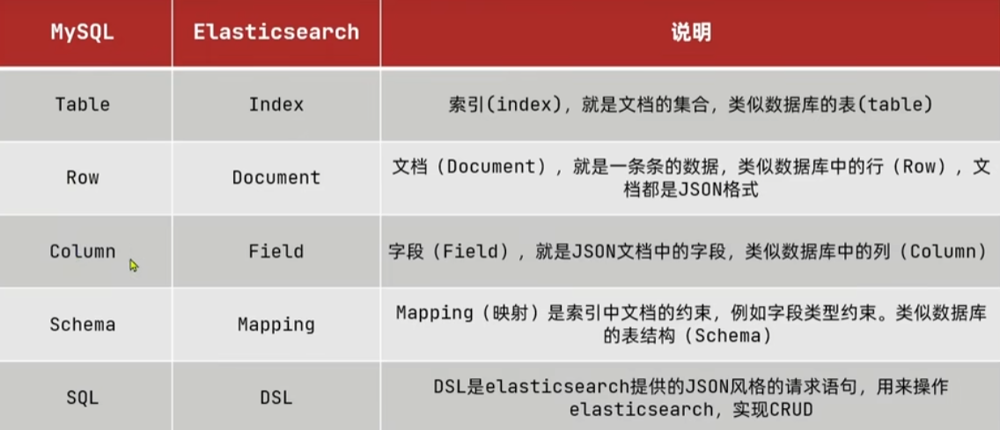

MySQL擅长于事务操作，可以确保数据的一致性和安全性；而ES不具备事务，但是其擅长海量数据的搜索、分析和计算。在实际情况下两者往往需要配合使用，而不是只使用其中一个并试图完全代替另一个的功能。

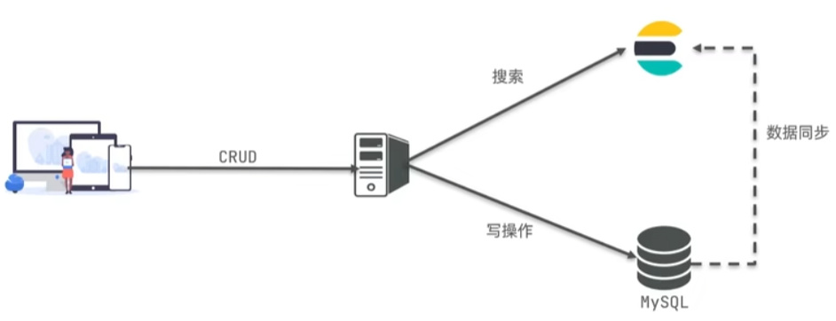

### 部署单点ES

如果ES需要连接Kibana容器等中间件，需要创建一个网络来让它们互连。

```sh
docker network create es-net
```

直接运行docker pull拉取ES即可，然后执行docker run运行：

```shell
docker run -d --name es -e "ES_JAVA_OPTS=-Xms1024m -Xmx1024m" -e "discovery.type=single-node" \
-v es-data:/usr/share/elasticsearch/data \
-v es-plugins:/usr/share/elasticsearch/plugins \
--privileged --network es-net \
-p 9200:9200 -p 9300:9300 \
elasticsearch:7.12.1
```

- 其中环境变量ES_JAVA_OPTS指定了分配给ES的内存的最小和最大值；
- 环境变量discovery.type指定了ES为单点部署；
- -v参数指定数据卷挂载，es容器内的data目录存放文档，而plugins目录存放插件；
- --privileged用于提升容器的权限，使其能够执行一些特殊的系统任务，例如访问主机的内核参数；
- --network参数指定加入的网络；
- -p指定了两个端口，其中容器的9200端口用于外部访问，而9300端口用于ES集群内部访问，因此这里实际用不到。

成功运行容器后，访问9200端口应当能看到一串描述容器的Json串。

### 部署Kibana

Kibana可以提供一个ES的可视化界面，便于进行DSL语句的操作等等。

docker pull拉取kibana镜像以后，执行以下docker run运行：

```sh
docker run -d --name kibana \
-e ELASTICSEARCH_HOSTS=http://es:9200 \
--network es-net -p 5601:5601 kibana:7.12.1
```

其中环境变量指定了ES的端口位于9200，当Kibana和ES位于同一网络中时可以用服务名代替主机名。

### IK分词器

ES在建立倒排索引时需要对文档进行分词，在搜索时也会对用户的输入进行分词。默认的分词规则对于英文语句的切分很有效，但是对中文不够友好，基本上只能将中文语句划分成一个一个单字。因此我们需要根据使用的语言，更换不同的分词器来更好地切分语句。对于中文，IK分词器十分地智能且常用。

如果ES容器内没有IK分词器，可以利用docker exec命令进入容器，执行以下安装语句：

```shell
./bin/elasticsearch-plugin install https://github.com/medcl/elasticsearch-analysis-ik/releases/download/v7.12.1/elasticsearch-analysis-ik-7.12.1.zip
```

本质上是从该GitHub网址下载分词器并安装到plugins目录下，因此利用es-plugins数据卷，也可以直接在GitHub下载压缩包，解压到数据卷挂载点即可。

安装完毕后可以在Kibana的Dev tools利用以下语句测试：

```json
POST _analyze
{
  "analyzer": "ik_smart",
  "text" : "我今天买了一双鞋"
}
```

POST指定发送的是POST请求；_analyze是一个帮助分析语句如何分词的API；analyzer属性可以指定分词器，例如standard标准分词器——它可以对英语智能分词，但是对中文效果较差。

当我们完成了IK分词器的安装后，有以下两种analyzer：

- ik_smart：粗粒度的分词，它从长语句开始分词，不能分词则查看其中的短语句，当长语句是一个term时，便不再继续查看更短的语句，例如”程序员“一词在这种分词规则下只会被分为”程序员“；
- ik_max_word：细粒度的分词，这种分词规则即便将长语句分成了一个term，也会继续查看其中的短语句，例如“程序员”会被分为“程序员”、“程序”和“员”三个词。

#### 拓展词库

IK分词器底层拥有自己的字典，分词的原理就是将语句中的词语与字典进行比对。但是分词器字典往往不会包含所有我们想要得到的词，也常常会放行我们不想要的屏蔽词。因此IK分词器提供了一种功能，可以让我们在其字典库里加入词，或者停用词。

在config中找到IKAnalyzer.cfg.xml文件：

```xml
<?xml version="1.0" encoding="UTF-8"?>
<!DOCTYPE properties SYSTEM "http://java.sun.com/dtd/properties.dtd">
<properties>
        <comment>IK Analyzer 扩展配置</comment>
        <!--用户可以在这里配置自己的扩展字典-->
        <entry key="ext_dict">ext.dic</entry>
         <!--用户可以在这里配置自己的扩展停止词字典   添加停用词词典-->
        <entry key="ext_stopwords">stopword.dic</entry>
</properties>
```

注意，其中的ext.dic和stopword.dic是同目录下的文件名，没有则自己创建即可。在其中书写扩展词/屏蔽词后重启ES即可生效，每一行写一个扩展词/屏蔽词。

#### 索引库操作

##### mapping属性

mapping是对索引库中文档的约束，类似于MySQL中的Schema表结构。常见的mapping属性有：

- type：字段数据类型，常见的简单类型有：
  - 字符串：text（可分词的文本）、keyword（不需要分词的精确值）
  - 数值：long、integer、short、byte、float、double
  - 布尔：boolean
  - 日期：date
  - 对象：object
- index：是否创建倒排索引，默认为true
- analyzer：使用的分词器
- properties：某个字段的子字段
- ... ...

##### 创建索引库

ES中通过Restful请求操作索引库和文档，请求内容用DSL语句表示。创建索引库及其mapping的DSL语句如下：

```json
PUT /rybin // PUT创建索引库，斜杠后是索引库名
{
  "mappings": { // 创建索引库的mapping
    "properties": { // mapping内有哪些字段
      "info": {
        "type": "text",
        "analyzer": "ik_smart"
      },
      "email": {
        "type": "keyword",
        "index": false
      },
      "name": {
        "type": "object",  // 创建对象类型的字段
        "properties": { // 定义子字段
          "firstName": {
            "type": "keyword"
          },
          "lastName": {
            "type": "keyword"
          }
        }
      }
    }
  }
}
```

##### 查询索引库

```json
GET /rybin // GET后跟索引库名即可
```

##### 修改索引库

索引库能支持添加字段或其他信息，但不允许修改已有信息（因为修改已有信息会破坏已存在的倒排索引）：

```json
PUT /rybin/_mapping // 为索引库的mapping添加了一个字段
{
  "properties": {
    "age": {
      "type": "integer"
    }
  }
}
```

但如果PUT中是修改已有信息，则会返回一个错误。

##### 删除索引库

```json
DELETE /rybin // DELETE后跟索引库名即可
```

#### 文档操作

##### 添加文档

```json
POST /rybin/_doc/1 // 添加文档的格式：POST /索引库名/_doc/文档id
{
  "info": "Java程序员",
  "email": "KDB@123.com",
  "name": {
    "firstName": "Kevin",
    "lastName": "De bruyne"
  }
}
```

##### 查询文档

```json
GET /rybin/_doc/1
```

##### 删除文档

```json
DELETE /rybin/_doc/1
```

##### 修改文档

1、全量修改

除了请求方式，与增加文档的语句基本一致，其会先查找文档id，如果有则删除原有文档，然后进行添加。

```json
PUT /rybin/_doc/1
{
  "info": "Java程序员",
  "email": "KDB@123.com",
  "name": {
    "firstName": "Kevin",
    "lastName": "De bruyne"
  }
}
```

2、增量修改

查找文档id，只修改部分字段。

```json
POST /rybin/_update/1
{
  "doc": {
    "email": "Kevin@123.com"
  }
}
```

### RestClient

ES官方提供了各种不同语言的客户端，用来操作ES。这些客户端本质上就是组装DSL语句，通过http请求发送给ES。因此Java当然也拥有用于操作ES的RestClient。

以下示例将要使用的sql表：

```sql
CREATE TABLE `tb_hotel`  (
  `id` bigint(20) NOT NULL COMMENT '酒店id',
  `name` varchar(255) CHARACTER SET utf8mb4 COLLATE utf8mb4_general_ci NOT NULL COMMENT '酒店名称',
  `address` varchar(255) CHARACTER SET utf8mb4 COLLATE utf8mb4_general_ci NOT NULL COMMENT '酒店地址',
  `price` int(10) NOT NULL COMMENT '酒店价格',
  `score` int(2) NOT NULL COMMENT '酒店评分',
  `brand` varchar(32) CHARACTER SET utf8mb4 COLLATE utf8mb4_general_ci NOT NULL COMMENT '酒店品牌',
  `city` varchar(32) CHARACTER SET utf8mb4 COLLATE utf8mb4_general_ci NOT NULL COMMENT '所在城市',
  `star_name` varchar(16) CHARACTER SET utf8mb4 COLLATE utf8mb4_general_ci NULL DEFAULT NULL COMMENT '酒店星级，1星到5星，1钻到5钻',
  `business` varchar(255) CHARACTER SET utf8mb4 COLLATE utf8mb4_general_ci NULL DEFAULT NULL COMMENT '商圈',
  `latitude` varchar(32) CHARACTER SET utf8mb4 COLLATE utf8mb4_general_ci NOT NULL COMMENT '纬度',
  `longitude` varchar(32) CHARACTER SET utf8mb4 COLLATE utf8mb4_general_ci NOT NULL COMMENT '经度',
  `pic` varchar(255) CHARACTER SET utf8mb4 COLLATE utf8mb4_general_ci NULL DEFAULT NULL COMMENT '酒店图片',
  PRIMARY KEY (`id`) USING BTREE
) ENGINE = InnoDB CHARACTER SET = utf8mb4 COLLATE = utf8mb4_general_ci ROW_FORMAT = Compact;
```

对应表结构，在ES建立索引库：

```json
PUT /hotel
{
  "mappings": {
    "properties": {
      "id": {
        "type": "keyword"
      },
      "name": {
        "type": "text",
        "analyzer": "ik_max_word",
        "copy_to": "all"
      },
      "address": {
        "type": "keyword",
        "index": false
      },
      "price": {
        "type": "integer"
      },
      "score": {
        "type": "integer"
      },
      "brand": {
        "type": "keyword",
        "copy_to": "all"
      },
      "city": {
        "type": "keyword"
      },
      "starName": {
        "type": "keyword"
      },
      "business": {
        "type": "keyword",
        "copy_to": "all"
      },
      "location": {
        "type": "geo_point"
      },
      "pic": {
        "type": "keyword",
        "index": false
      },
      "all": {
        "type": "text",
        "analyzer": "ik_max_word"
      }
    }
  }
}
```

其中location字段的type是geo_point，geo_point是一个组合经度和纬度在一个字符串的专用于表达地理坐标点的类型。

在查询中可能常常需要组合多个字段进行查询，但多字段查询会使得效率降低，因此ES中可以创建一个索引专用的字段，这里取名为all，并且支持分词，在其他字段中使用"copy_to"指向这个字段，就可以使得针对这些字段的多字段查询转变为单字段查询，ES为这种查询进行了性能的优化。

#### RestClient基本使用

在POM文件引入依赖

```xml
<dependency>
    <groupId>org.elasticsearch.client</groupId>
    <artifactId>elasticsearch-rest-high-level-client</artifactId>
</dependency>
```

如果想要使用的RestClient版本与Spring Boot预设的版本不一致，可以使用以下配置覆盖预设的版本

```xml
<properties>
    <elasticsearch.version>7.12.1</elasticsearch.version>
</properties>
```

想要使用RestClient，先要创建RestHighLevelClient

```java
// HttpHost的create方法中传入的是ES的外部访问端口
client = new RestHighLevelClient(RestClient.builder(HttpHost.create("http://192.168.50.118:9200")));
```

#### 创建索引库

```java
@Test
// 该测试往ES中创建了一个名为hotel的索引库，仔细观察会发现这个流程实际上与Kibana
// 发送DSL语句的方式很相似：请求方法 + 索引名 + DSL语句
void createIndex() throws IOException {
    // 创建一个用于创建索引的CreateIndexRequest，索引名为hotel
    CreateIndexRequest request = new CreateIndexRequest("hotel");
    // MAPPING_TEMPLATE是自己编写的包含DSL语句的字符串，此处用到的DSL语句即先前说明的hotel创建语句，
    // 第二个参数指明内容为JSON格式
    request.source(MAPPING_TEMPLATE, XContentType.JSON);
    // indices方法返回索引操作集，调用create方法即可发送索引创建命令，
    // 第二个参数可以设置请求头，这里使用默认
    client.indices().create(request, RequestOptions.DEFAULT);
}
```

#### 查询索引库是否存在

```java
@Test
void indexExist() throws IOException {
    GetIndexRequest request = new GetIndexRequest("hotel");

    Boolean exist = client.indices().exists(request, RequestOptions.DEFAULT);

    System.out.println(exist ? "索引存在" : "索引不存在");
}
```

#### 删除索引库

```java
@Test
void deleteIndex() throws IOException {
    DeleteIndexRequest request = new DeleteIndexRequest("hotel");

    client.indices().delete(request, RequestOptions.DEFAULT);
}
```

#### 新增文档

```java
@Test
void insertDoc() throws IOException {
    // Hotel类是用于数据库存储的数据类型
    Hotel hotel = hotelService.getById(61083);
    // HotelDoc与Hotel的数据成员有区别，用于ES存储
    HotelDoc hotelDoc = new HotelDoc(hotel);

    IndexRequest request = new IndexRequest("hotel").id(hotelDoc.getId().toString());
	// 使用FastJson可以直接将HotelDoc转成符合索引库映射的Json格式
    request.source(JSON.toJSONString(hotelDoc), XContentType.JSON);

    client.index(request, RequestOptions.DEFAULT);
}
```

#### 查询文档

```java
@Test
void lookupDoc() throws IOException {
    GetRequest request = new GetRequest("hotel", "61083");

    GetResponse document = client.get(request, RequestOptions.DEFAULT);
	// 这里获取到的是source的JSON字符串格式
    String source = document.getSourceAsString();
	// 使用FastJson转换为HotelDoc
    HotelDoc hotel = JSON.parseObject(source, HotelDoc.class);

    System.out.println(hotel);
}
```

#### 修改文档

增量修改

```java
@Test
void modifyDoc() throws IOException {
    UpdateRequest request = new UpdateRequest("hotel", "61083");

    // doc方法是一个接收不定参数的方法，它的格式是一个key后接一个value，
    // 意为将该key的值改为value
    request.doc(
            "price", 100,
            "starName", "四钻"
    );

    client.update(request, RequestOptions.DEFAULT);
}
```

#### 删除文档

```java
@Test
void deleteDoc() throws IOException {
    DeleteRequest request = new DeleteRequest("hotel", "61083");

    client.delete(request, RequestOptions.DEFAULT);
}
```

#### 批量新增文档

```java
@Test
void bulkInsert() throws IOException {
    // MyBatis查询全部Hotel
    List<Hotel> hotels = hotelService.list();
	// 创建批处理Request
    BulkRequest bulkRequest = new BulkRequest();

    hotels.forEach(hotel -> {
        // 记得将数据库存储格式的Hotel转换成ES存储格式的HotelDoc
        HotelDoc hotelDoc = new HotelDoc(hotel);
        // 对于每个hotelDoc创建一个IndexRequest并放入BulkRequest，
        // 最后直接执行BulkRequest即可
        bulkRequest.add(new IndexRequest("hotel")
                .id(hotelDoc.getId().toString())
                .source(JSON.toJSONString(hotelDoc), XContentType.JSON)
        );
    });

    client.bulk(bulkRequest,  RequestOptions.DEFAULT);
}
```

### DSL查询语法

ES提供了基于JSON的DSL(Domain Specific Language)语句来定义查询。我们在前面也使用了一些DSL基本语句。

常见的查询类型：

- 查询所有文档，例如match_all
- Full text全文检索查询：利用分词器对用户输入内容分词，然后进行倒排索引匹配。例如match、multi_match
- 精确查询：根据精确词条值查询文档，一般查找keyword、数值、日期等类型字段。例如ids、range、term
- 地理查询：根据经纬度查询，例如geo_distance、geo_bounding_box
- compound复合查询：复合查询可以将上述查询组合起来合并查询条件

查询的基本语法如下：

```json
GET /indexName/_search
{
  "query": {
    "查询类型": {
      "查询条件": "条件值"
    }
  }
}
```

#### 查询所有文档

```json
# 一般查询所有文档时，如果发现返回的文档并不全，这是因为显示的文档数目有限制
GET /hotel/_search
{
  "query": {
    "match_all": {}
  }
}
```

#### 全文检索查询

##### match查询

可以对用户的输入进行分词，在倒排索引库检索。但只支持单字段查询。

```json
GET /hotel/_search
{
  "query": {
    "match": {
      "city": "上海"
    }
  }
}
```

##### multi_match查询

与match查询功能类似，但支持同一内容的多字段查询。

```json
GET /hotel/_search
{
  "query": {
    "multi_match": {
      "query": "外滩", 
      "fields": ["name", "business"]
    }
  }
}
```

#### 精确查询

精确查询一般用于查找不被分词的类型，它是一种不会对输入内容进行分词的查询。

##### term查询

term根据词条值精确查询文档

```json
GET /hotel/_search
{
  "query": {
    "term": {
      "city": {
        "value": "上海"
      }
    }
  }
}
```

##### range查询

range查询能够查询到词条值在给定范围内的文档，可以查询数值、日期等类型

```json
GET /hotel/_search
{
  "query": {
    "range": {
      "price": {
        # 此处gte代表大于等于，lte代表小于等于
        "gte": 100,
        "lte": 200
      }
    }
  }
}
```

#### 地理查询

根据经纬度进行查询。

##### geo_bounding_box查询

查询某个字段的经纬度落在给定矩形范围内的文档

```json
GET /hotel/_search
{
  "query": {
    "geo_bounding_box": {
      "location": {
        "top_left": {
          "lat": "31.1",
          "lon": "121.5"
        },
        "bottom_right": {
          "lat": "30.9",
          "lon": "121.7"
        }
      }
    }
  }
}
```

##### geo_distance查询

查询某个字段离给定地理坐标小于一定距离的文档

```json
GET /hotel/_search
{
  "query": {
    "geo_distance": {
      "distance": "15km",
      "location": "31.21, 121.5"
    }
  }
}
```

#### 复合查询

复合(compound)查询可以将多个简单查询组合起来实现更复杂的查询逻辑，例如function score算分函数查询，可以通过计算文档的相关性得分来为查询结果排名。

##### 相关性算分

当使用match查询时，文档结果会根据搜索词条的关联度打分，返回结果按分数降序排列。

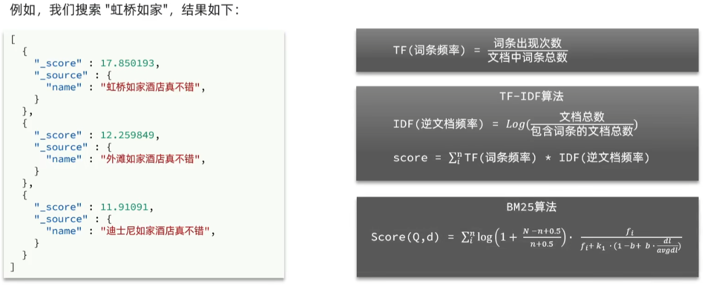

TF-IDF和BM25都是用来计算文档得分的算法。其中ES5前TF-IDF算法使用较多，而新版本中则更多采用BM25算法。这是因为TF-IDF算法的得分会随词频增高而无限增大，而BM25算法改进了这一缺陷，使得词频对于分数的贡献有上界，并且得分增长更加平滑。

function_score查询

使用function_score查询可以改变文档的相关性算分得到新的排序。

function_score的三要素：过滤条件、算分函数、加权模式

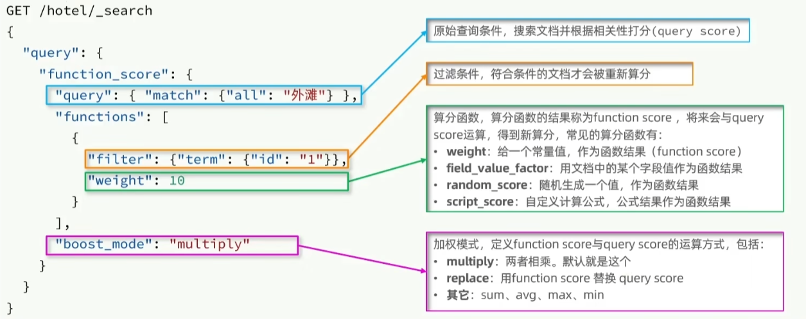

##### Boolean查询

布尔查询是一个或多个查询语句的组合。子查询的组合方式有：

- must：必须匹配每个子查询，参与算分，类似“与”
- should：选择性匹配子查询，参与算分，类似“或”
- must_not：必须不匹配，类似“非”
- filter：必须匹配，但不参与算分

可以理解为其用布尔运算将子查询组合在了一起，与MySQL的复杂查询SELECT ... WHERE ... AND ... OR ...有点类似。

示例

```json
GET /hotel/_search
{
  "query": {
    "bool": {
      "must": [
        {
          "match": {
            "name": "如家" # 查询关键字“如家”
          }
        }
      ],
      "must_not": [
        {
          "range": {
            "price": {
              "gte": 700 # 必须不大于等于700，即小于700
            }
          }
        }
      ],
      "filter": [ # 必须符合这个条件，但不参与算分
        {
          "geo_distance": {
            "distance": "10km",
            "location": {
              "lat": "31.21",
              "lon": "121.5"
            }
          }
        }
      ]
    }
  }
}
```

如果将filter中的子查询放在must则会发现结果的得分改变了，这说明当子查询放在filter中时不会参与算分。

注意，算分操作会消耗es性能，因此为了提高性能，应尽量把不需要参与算分的查询放在filter和must_not中。

#### 搜索结果处理

##### 排序

ES支持对搜索结果排序，默认按照相关度算分_score排序。可以排序的字段类型有：keyword类型、数值类型、地理坐标类型、日期类型等。

示例

```json
GET /hotel/_search
{
  "query": { # 查询语句
    "match_all": {}
  },
  "sort": [ # 查询结果排序，二者是并列关系
    {
      "score": { # 可以简写成"score": "desc"
        "order": "desc" # 升序asc，降序desc
      }
    },
    {
      "_geo_distance": {
        "location": { # 可以简写成 "location": "31.1, 121.5"
          "lat": 31.1,
          "lon": 121.5
        },
        "order": "asc",
        "unit": "km" # 距离的显示单位
      }
    }
  ]
}
```

##### 分页

ES默认只返回排序后前10条文档，如果需要查询更多文档则需要使用分页。ES通过修改from、size参数指定从第几条开始，返回几条文档。

示例

```json
GET /hotel/_search
{
  "query": {
    "match_all": {}
  },
  "from": 20, # 从第20条文档开始返回
  "size": 10, # 返回10条文档
  "sort": [
    {
      "price": { # 按价格降序排序后再返回
        "order": "desc"
      }
    }
  ]
}
```

然而，因为ES支持分布式，当查询排序结果时需要从多个服务器获取文档合并再排序，才能获取到真实的排序。当获取文档数较大时对于性能的损耗也是巨大的，ES因此规定了查询结果总数的上限，即from+size不能超过10000，由此产生了深度分页问题。

针对深度分页问题，ES提供了2种解决方案：

- search after：根据前一页文档的排序值来查询下一页文档，因此只能向后查询，不支持随机翻页，这种方案可以应用于例如手机向下滚动翻页。
- scroll：将排序结果形成快照存储在内存中，这种方案内存消耗大并且结果非实时，官方已不推荐使用。

##### 高亮

在搜索结果中把搜索关键字突出显示。其实是搜索结果中的关键字用<em>标签修饰，并且在CSS中指定<em>的样式，就可以使得在前端显示的搜索结果的关键字呈现高亮。而ES可以帮助我们在返回搜索结果时就用标签将搜索关键字修饰。

示例

```json
GET /hotel/_search
{
  "query": {
    "match": {
      "all": "如家"
    }
  },
  "highlight": {
    "fields": {
      "name": {
        "require_field_match": "false",
        "pre_tags": "<em>",
        "post_tags": "</em>"
      }
    }
  }
}
```

ES默认情况下，高亮字段必须与搜索字段一致，否则不能添加标签，改变require_field_match参数为false就可以忽略不一致。而pre_tag和post_tag参数分别指定在关键字的前后增加什么标签，不写则默认被<em></em>修饰。

注意，包含高亮的查询的返回结果并不直接就是带有标签的值，而是source字段中存储原始文档，highlight字段中才存储了关键字被标签包围的文本值。

### RestCilent查询文档

RestCilent进行match_all查询

```java
@Test
void searchMatchAll() throws IOException {
    // 创建SearchRequest对象，并指定索引名
    SearchRequest request = new SearchRequest("hotel");
    // source返回的是SearchSourceBuilder，用于完成DSL语句的功能，可以进行链式编程，
    // 例如指定查询条件、分页、排序等
    request.source().query(QueryBuilders.matchAllQuery());
    // search方法发送搜索请求，并返回一个SearchResponse，
    // result拥有搜索相关的信息，比如命中结果、总条数、分页信息等
    SearchResponse result = client.search(request, RequestOptions.DEFAULT);
    // getHits返回Hits字段，里面又包含_index、total、搜索结果等信息
    SearchHits searchHits = result.getHits();
    // Total是查询结果的数目
    long hitsNum = searchHits.getTotalHits().value;
    System.out.printf("搜索到%d条数据\n", hitsNum);
    // SearchHit数组存放的是真正的文档结果
    SearchHit[] hitsArr = searchHits.getHits();
    for (SearchHit hit : hitsArr) {
        String jsonSource = hit.getSourceAsString();

        HotelDoc hotelDoc = JSON.parseObject(jsonSource, HotelDoc.class);

        System.out.println(hotelDoc);
    }
}
```

其对应ES的DSL语句为：

```json
GET /hotel/_search
{
  "query": {
    "match_all": {}
  }
}
```

#### 全文检索查询

编写查询的基本步骤与之前的示例类似，而只需要更改根据DSL语句创建不同的QueryBuilder并赋给request.source()即可。

示例

```java
@Test
void searchMatchAll() throws IOException {
    SearchRequest request = new SearchRequest("hotel");
    // 只修改了这部分，利用match查询搜索city字段包括上海的文档
    request.source().query(QueryBuilders.matchQuery("city", "上海"));

    SearchResponse result = client.search(request, RequestOptions.DEFAULT);

    SearchHits searchHits = result.getHits();

    long hitsNum = searchHits.getTotalHits().value;
    System.out.printf("搜索到%d条数据\n", hitsNum);
    
    SearchHit[] hitsArr = searchHits.getHits();
    for (SearchHit hit : hitsArr) {
        String jsonSource = hit.getSourceAsString();

        HotelDoc hotelDoc = JSON.parseObject(jsonSource, HotelDoc.class);

        System.out.println(hotelDoc);
    }
}
```

#### 精确查询

示例

```java
// 以下只展示变动的代码
// 利用term查询搜索city字段的精确值为上海的文档
request.source().query(QueryBuilders.termQuery("city", "上海"));
```

#### 复合查询

示例

```java
/
之所以能链式编程，是因为这些能够指定DSL语句的函数都返回QueryBuilder类型的对象
/
request.source().query(QueryBuilders.boolQuery() // 创建Boolean查询
        .must(QueryBuilders.termQuery("city", "上海")) // must字段要求city精确匹配“上海”
        .filter(QueryBuilders.rangeQuery("price") // filter字段使用range查询
                .gte(200) // 要求price >= 200
                .lte(1000))); // 要求price <= 1000
```

其对应的ES的DSL语句如下：

```json
GET /hotel/_search
{
  "query": {
    "bool": {
      "must": [
        {
          "term": {
            "city": "上海"
          }
        }
      ],
      "filter": [
        {
          "range": {
            "price": {
              "gte": 200,
              "lte": 1000
            }
          }
        }
      ]
    }
  }
}
```

#### 搜索结果处理

##### 排序和分页

示例

```java
@Test
void sortAndHighlight() throws IOException {
    SearchRequest request = new SearchRequest("hotel");
	// 指定查询方式，这里是match_all
    request.source().query(QueryBuilders.matchAllQuery());
	// 指定排序方式
    request.source().sort("price", SortOrder.ASC);
	// 指定分页
    int page = 3, num = 5;
    request.source().from((page - 1)  num).size(num);
	
    // 以下结果处理代码与前文一致
    SearchResponse result = client.search(request, RequestOptions.DEFAULT);

    SearchHits searchHits = result.getHits();

    long hitsNum = searchHits.getTotalHits().value;
    System.out.printf("搜索到%d条数据\n", hitsNum);

    SearchHit[] hitsArr = searchHits.getHits();
    for (SearchHit hit : hitsArr) {
        String jsonSource = hit.getSourceAsString();

        HotelDoc hotelDoc = JSON.parseObject(jsonSource, HotelDoc.class);

        System.out.println(hotelDoc);
    }
}
```

这里query、sort、from、size函数均返回SearchSourceBuilder，尽管示例中将它们分别调用，不过也可以写成链式调用的形式。

##### 高亮

在ES中，包含高亮的查询的结果将原始文档和被标签修饰的字段值分别存储，因此想要获得被标签修饰的文档不仅需要在RestClient中构建DSL语句，还需要对返回的结果进行解析处理。

```java
@Test
void sortAndHighlight() throws IOException {
    SearchRequest request = new SearchRequest("hotel");
	// match查询all字段包含“如家”的文档
    request.source().query(QueryBuilders.matchQuery("all", "如家"));
    // 排序
    request.source().sort("price", SortOrder.ASC);
    // 分页
    int page = 3, num = 5;
    request.source().from((page - 1)  num).size(num);
    // 高亮name字段，并且置require_filed_match参数为false
    request.source().highlighter(new HighlightBuilder()
            .field("name")
            .requireFieldMatch(false));
	
    SearchResponse result = client.search(request, RequestOptions.DEFAULT);

    SearchHits searchHits = result.getHits();

    long hitsNum = searchHits.getTotalHits().value;
    System.out.printf("搜索到%d条数据\n", hitsNum);

    SearchHit[] hitsArr = searchHits.getHits();
    for (SearchHit hit : hitsArr) {
        String jsonSource = hit.getSourceAsString();

        HotelDoc hotelDoc = JSON.parseObject(jsonSource, HotelDoc.class);
		// 结果解析只有该处有变化
        // 先从hit中获取highlight字段，这是一个Map对象，key为指定高亮的字段名
        Map<String, HighlightField> highlightFields = hit.getHighlightFields();
		// 从Map中获取到的HighlightFiled可以调用getFragments获取高亮文本的数组，
        // 数组中每个对象都是Text类型，调用string函数来将其转换为String类型。
        String highlightedField = highlightFields.get("name").getFragments()[0].string();
		// 最后用高亮处理过的字段来替换掉hotelDoc中的原始字段即可
        hotelDoc.setName(highlightedField);

        System.out.println(hotelDoc);
    }
}
```

### 聚合

聚合aggregation是对文档的统计、分析和运算。类似于MySQL中聚合函数的概念。

- bucket桶聚合：用于对文档进行分组
  - Term Aggregation：按照文档字段值分组，不能对可分词字段分组
  - Date Aggregation：按照日期阶梯分组，例如同一周的文档为一组
- metrics度量聚合：对字段值进行计算，例如计算平均值、最大值、最小值等
  - Avg求平均值
  - Max求最大值
  - Min求最小值
  - Stats同时求Max、Min、Sum等
- pipeline管道聚合：将其他聚合的结果为基础做聚合

被聚合的字段可以是keyword、数值、日期、布尔等类型，不能是可分词字段。

#### Bucket聚合

聚合的三要素是聚合名称、聚合类型和聚合字段。

按照brand字段聚合

```json
GET /hotel/_search
{
  "size": 0,
  "aggs": { # 指定一种或多种聚合
    "brandArg": { # 聚合的名字
      "terms": { # 聚合类型，这里根据字段进行聚合
        "field": "brand", # 根据brand字段进行聚合
        "size": 10, # 显示聚合完成后的前10条数据
        "order": {
          "_count": "asc"
        }
      }
    }
  }
}
```

外层的size指定查询结果的返回数量，而聚合内的size是指定聚合操作后的返回数据的数量。默认情况下bucket聚合会计算一个桶内的 _count并将结果按 _count排序，可以通过order参数指定排序方式。

如果想要限定想要聚合的文档范围，利用query查询即可指定范围。

示例

```json
GET /hotel/_search
{
  "query": {
    "range": {
      "price": {
        "gte": 0,
        "lte": 300
      }
    }
  }, 
  "size": 0,
  "aggs": {
    "brandAgg": {
      "terms": {
        "field": "brand",
        "size": 10,
        "order": {
          "_count": "asc"
        }
      }
    }
  }
}
```

这里先使用query进行查询，再将结果进行聚合。效果上就是限定了聚合的范围。

#### Metrics聚合

先进行桶聚合，再对每个桶进行度量聚合

```json
GET /hotel/_search
{
  "size": 0,
  "aggs": {
    "brandAgg": {
      "terms": {
        "field": "brand",
        "size": 10,
        "order": {
          "scoreAgg.avg": "desc" # 根据每个桶的分数平均值降序排序，可以发现这里使用.来描述子字段
        }
      },
      "aggs": {
        "scoreAgg": {
          "stats": {
            "field": "score" # 对score进行stats聚合
          }
        }
      }
    }
  }
}
```

这里是将metrics聚合的aggs嵌套在了bucket聚合中，目的是对于每个桶进行聚合计算。当然也可以将aggs写在最外层，只是这样做将聚合计算所有文档，具体如何编写依业务场景与需求而定。

### RestClient实现聚合

#### Bucket聚合

```java
@Test
void bucketAggregation() throws IOException {
    SearchRequest request = new SearchRequest("hotel");

    // 调用aggregation函数构建DSL语句
    request.source().aggregation(AggregationBuilders // 创建TermsAggregationBuilder并且可以链式调用
                    .terms("brandAgg") // term函数表明聚合类型，参数指定聚合名称
                    .field("brand")	// 指定聚合字段
                    .size(10)); // 指定显示的条数

    SearchResponse response = client.search(request, RequestOptions.DEFAULT);
	// 调用response的getAggregations函数返回aggregations，再调用get函数获取
    // 想要的聚合名称对应的结果，此处需要用Terms来接收，否则无法调用getBuckets函数
    Terms scoreAgg = response.getAggregations().get("brandAgg");
	// getBuckets函数获取bucket的数组
    List<? extends Terms.Bucket> buckets = scoreAgg.getBuckets();

    for (Terms.Bucket bucket : buckets) {
        // key是品牌名，docCount是该桶结果的数量
        String key = bucket.getKeyAsString();
        long docCount = bucket.getDocCount();
        System.out.printf("%s: %d\n", key, docCount);
    }
}
```

### 自动补全

#### 拼音分词器

拼音分词器可以将中文语句分词成拼音，借助拼音分词器能够实现对于拼音的自动补全。analyzer-pinyin就是一个拼音分词器，它与ik分词器由同一个作者编写，可以在GitHub上找到。

在ES容器中可以按照与安装IK分词器同样的流程安装pinyin分词器：

先用exec命令进入容器

```bash
docker exec -it es bash
```

这里的es是先前创建es时自定义的容器名。

在容器内使用如下命令安装pinyin分词器

```bash
./bin/elasticsearch-plugin install https://github.com/medcl/elasticsearch-analysis-pinyin/releases/download/v7.12.1/elasticsearch-analysis-pinyin-7.12.1.zip 
```

版本应该和es匹配，否则可能出现错误。

最后用docker restart命令重启es容器即可。

等待es服务重启完成后，利用kibana的开发工具测试如下DSL语句：

```json
GET /_analyze
{
  "text": ["足球比赛很精彩"],
  "analyzer": "pinyin"
}
```

如果返回的分词是拼音，则说明pinyin分词器安装成功。

#### 自定义分词器

ES中的分词器(analyzer)分成三部分：

- character filters：在tokenizer前对文本进行处理。例如删除字符、替换字符。
- tokenizer：将文本按照一定规则切割成词条(term)。例如ik_smart、keyword。
- tokenizer filters：将tokenizer输出的词条进一步处理。例如大小写转换、同义词转换、拼音转换等。

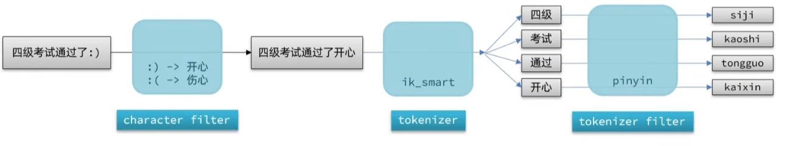

在创建索引库时，可以通过settings属性配置自定义analyzer：

```json
PUT /test
{
  "settings": {
    "analysis": { // 自定义analyzer、filter
      "analyzer": { // 自定义分词器
        "my_analyzer": { // 分词器名称
          "tokenizer": "ik_smart",
          "filter": "py"
        }
      },
      "filter": {
        "py": { // 自定义tokenizer filter
          "type": "pinyin", // 指定过滤器类型
          "keep_full_pinyin": false, // 这个属性会把一个词的每个字拆开翻译成拼音
          "keep_joined_full_pinyin": true, // 这个属性会把一个词整体翻译成拼音
          "keep_original": true, // 会保留原始输入
          "remove_duplicated_term": true, // 词条去重
          "non_chinese_pinyin_tokenize": true // 可以把连在一起的拼音分成词条，例如liudehua->liu de hua
        }
      }
    }
  },
  "mappings": {
    "properties": {
      "name": {
        "type": "text",
        "analyzer": "my_analyzer", // 插入文档时使用自定义分词器
        "search_analyzer": "ik_smart" // 搜索时使用该分词器
      }
    }
  }
}
```

之所以搜索时不使用自定义分词器（内含拼音分词器）是因为这样做的话用户的中文输入会搜索到可能不相关的同音词，例如搜索“狮子”可能也会搜索到“柿子”。而ik分词器并不会将中文输入分词成拼音的词条去查询倒排索引，也就自然不会搜索到同音词，而且ik分词器对于拼音输入也有效。

#### Completion Suggester自动补全查询

ES提供了Completion Suggester来帮助完成自动查询功能。该查询会匹配以用户输入为开头的词条并返回。为了提高补全查询的效率，需要补全查询的字段必须是completion类型。

创建一个简单的索引库，只有一个类型为completion的字段title

```json
PUT /test2
{
  "mappings": {
    "properties": {
      "title": {
        "type":"completion"
      }
    }
  }
}
```

插入文档

```json
POST /test2/_doc
{
  "title": ["Sony", "WH-1000BX3"]
}
```

这里用多词条的数组的形式存储，是为了让自动补全能够更灵活的匹配，对于这个文档，用"S"或"W"都能匹配到该文档，而如果不用数组改为"SonyWH-1000BX3"，则只能用"S"匹配到该文档。

查询语句

```json
GET /test2/_search
{
  "suggest": { // 定义查询
    "titleSuggest": { // 自定义查询的名称
      "text": "s", // 要自动补全的文本
      "completion": { // 指定查询类型
        "field": "title",
        "size": 10
      }
    }
  }
}
```

### RestClient实现自动补全

要使用自动补全，索引库需要将相关字段设置成suggestion属性，并且配置合适的分词器，因此我们使用如下DSL语句创建一个用于测试自动补全的索引库。

```json
PUT /hotel
{
  "settings": {
    "analysis": {
      "analyzer": {
        "text_anlyzer": {
          "tokenizer": "ik_max_word",
          "filter": "py"
        },
        "completion_analyzer": {
          "tokenizer": "keyword", // 该分词器不进行分词
          "filter": "py" // 该分词器允许转拼音
        }
      },
      "filter": {
        "py": {
          "type": "pinyin",
          "keep_full_pinyin": false,
          "keep_joined_full_pinyin": true,
          "keep_original": true,
          "limit_first_letter_length": 16,
          "remove_duplicated_term": true,
          "none_chinese_pinyin_tokenize": false
        }
      }
    }
  },
  "mappings": {
    "properties": {
      "id":{
        "type": "keyword"
      },
      "name":{
        "type": "text",
        "analyzer": "text_anlyzer",
        "search_analyzer": "ik_smart",
        "copy_to": "all"
      },
      "address":{
        "type": "keyword",
        "index": false
      },
      "price":{
        "type": "integer"
      },
      "score":{
        "type": "integer"
      },
      "brand":{
        "type": "keyword",
        "copy_to": "all"
      },
      "city":{
        "type": "keyword"
      },
      "starName":{
        "type": "keyword"
      },
      "business":{
        "type": "keyword",
        "copy_to": "all"
      },
      "location":{
        "type": "geo_point"
      },
      "pic":{
        "type": "keyword",
        "index": false
      },
      "all":{
        "type": "text",
        "analyzer": "text_anlyzer",
        "search_analyzer": "ik_smart"
      },
      "suggestion":{
          "type": "completion",
          "analyzer": "completion_analyzer" // 用于实现补全功能的字段，不需要对其分词
      }
    }
  }
}
```

想要使用RestClient实现的DSL语句：

```json
GET /hotel/_search
{
  "suggest": {
    "sgg": {
      "text": "h",
      "completion": {
        "field": "suggestion",
        "skipDuplicates": true,
        "size": 10
      }
    }
  }
}
```

该DSL语句返回的查询结果：

```json
{
  "took" : 1,
  "timed_out" : false,
  "_shards" : {
    "total" : 1,
    "successful" : 1,
    "skipped" : 0,
    "failed" : 0
  },
  "hits" : {
    "total" : {
      "value" : 0,
      "relation" : "eq"
    },
    "max_score" : null,
    "hits" : [ ]
  },
  "suggest" : {
    "sgg" : [
      {
        "text" : "上",
        "offset" : 0,
        "length" : 1,
        "options" : [
          {
            "text" : "三里屯",
            "_index" : "hotel",
            "_type" : "_doc",
            "_id" : "396189",
            "_score" : 1.0,
            "_source" : {
              "address" : "三丰北里3号",
              "brand" : "皇冠假日",
              "business" : "三里屯/工体/东直门地区",
              "city" : "北京",
              "id" : 396189,
              "location" : "39.92129, 116.43847",
              "name" : "北京朝阳悠唐皇冠假日酒店",
              "pic" : "https://m.tuniucdn.com/fb3/s1/2n9c/tT6ipLain1ZovR5gnQ7tJ4KKym5_w200_h200_c1_t0.jpg",
              "price" : 944,
              "score" : 46,
              "starName" : "五钻",
              "suggestion" : [
                "皇冠假日",
                "三里屯",
                "工体",
                "东直门地区"
              ]
            }
          }
          // 省略其他结果，足够展示返回结果的文本结构
        ]
      }
    ]
  }
}
```

RestClient测试代码

```java
@Test
void testSuggest() throws IOException {
    SearchRequest request = new SearchRequest("hotel");
	// 对应DSL语句的"suggest"
    request.source().suggest(new SuggestBuilder()
            //对应DSL语句中：声明suggestion名称，以及声明补全字段为suggestion
            .addSuggestion("sgg", SuggestBuilders.completionSuggestion("suggestion")
                    .prefix("h") // 对应指定text
                    .skipDuplicates(true)
                    .size(10)));

    SearchResponse response = client.search(request, RequestOptions.DEFAULT);

    // 获取了名为sgg的对象，对应返回结果中suggest下的sgg
    CompletionSuggestion sgg = response.getSuggest().getSuggestion("sgg");
	// 获取sgg下的options，options包含了所有结果文档
    List<CompletionSuggestion.Entry.Option> options = sgg.getOptions();

    options.forEach(option -> {
        // 对于每个option，获取text值，即自动补全功能匹配到的值
        String text = option.getText().toString();
        System.out.println(text);
    });
}
```

总之，使用RestClient编写Java代码查询ES，一个很好的方法就是对照DSL语句进行编写，RestClient所给的API与DSL语句的诸多关键字基本匹配。

### 数据同步

一般的项目中，ES中的数据来源于MySQL，因此MySQL数据变更时ES必须跟着进行变化，这就是ES和数据库之间的数据同步。

在单体架构中，可以在插入数据的过程中先写入MySQL再写入ES，即可实现数据同步。但是微服务的情景下，不同服务间相互不可访问数据库，因此需要使用其他方法完成数据同步。

#### 数据同步问题的解决方案

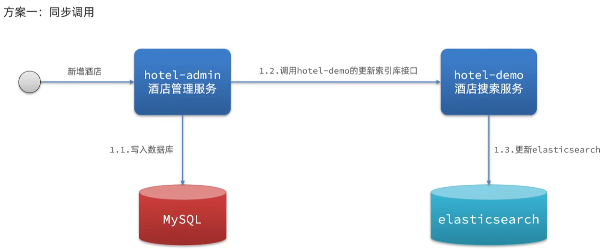

同步调用实现简单，但是耦合度高，若一个环节出错则会影响到别的环节。

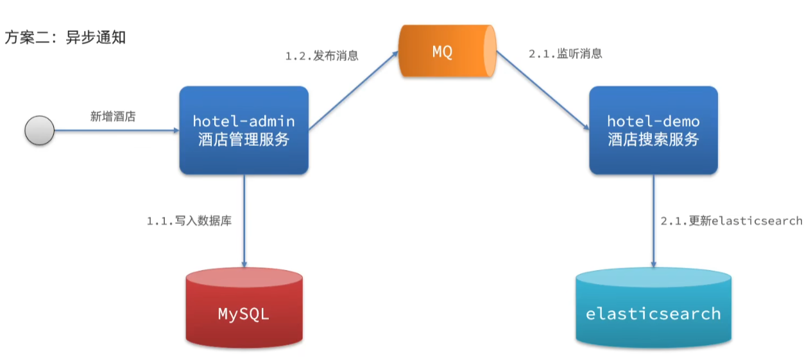

使用MQ中间件来异步通知ES服务完成数据同步，能够解除一定耦合，提高服务执行速度也能避免连环故障；但是需要依赖MQ的可靠性，MQ故障则会导致数据的不一致等问题。

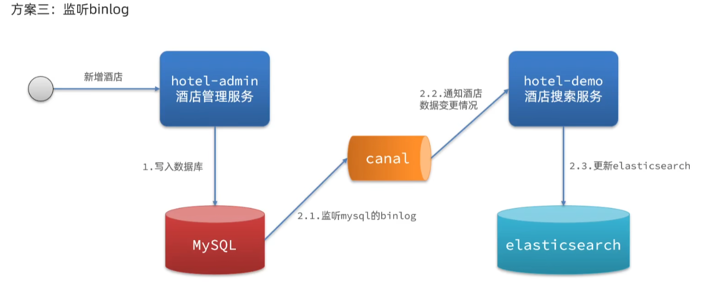

使用MySQL自带的binlog当MySQL写数据时binlog新增日志，只需要监听binlog即可在数据新增时自动为ES同步数据。这种方案完全解耦，但是binlog的开启会为MySQL服务器带来压力。

### ES集群

#### ES集群结构

单机的ES做数据存储会遇到两个问题：海量数据存储问题和单点故障问题。通过多台服务器构成ES集群能够解决这两个问题。

