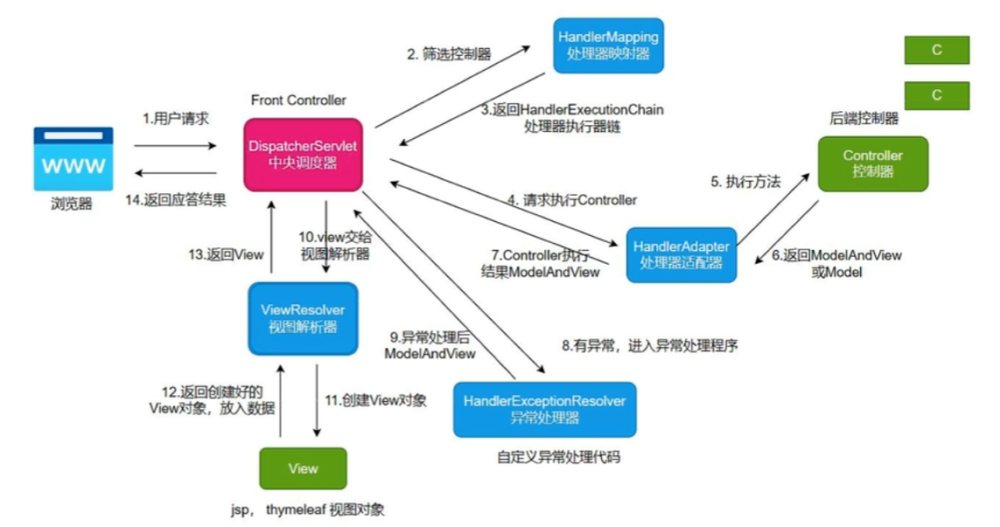

#  0 - Java17新特性

## Java record

record是Java中特殊类型的Java类，可用来创建不可变的类对象，因为其方便的创建方式能用于充当便利的数据载体。Jacckson2.12支持record类简化json转换。在Spring中可以用于简化Bean的创建。

### 定义一个record

创建record类：

```java
public record Student(Integer id, String name, String email, Integer age) {
}
```

访问对象属性：

```java
// record并不遵守Bean的创建规范，没有set/get方法，访问对象成员只能使用如下的public访问器，并且属性是只读的
String name = stu1.name();
Integer age = stu1.age();
```

record类内同样可以定义实例方法/静态方法：

```java
public String concat() {
    return this.name + this.age;
}
public static Integer speakAge() {
    return this.age;
}
```

### record构造方法

​	record中构造方法有三类：

- 紧凑型构造方法
- 规范构造方法
- 定制构造方法

```java
// 规范构造方法
public record Student(Integer id, String name, String email, Integer age) {
    // 紧凑构造方法没有参数也不用添加括号
    public Student {
        System.out.println(name);
    }
    // 参数个数自定义的定制构造方法，跟普通构造方法无异
    public Student(Integer id, String name) {
        this(id, name, null, null);
    }
}

```

**紧凑构造方法在编译后会合并入规范构造方法，效果上等同于每次创建对象（调用规范构造函数）时也都会执行紧凑构造方法。**

### 局部record

可以在各种代码块内定义局部record类，类似于局部内部类。

```java
public void test() {
        record Student(Integer id, String name, String email, Integer age) {} ;
        Student stu1 = new Student(1001, "qwe",          
        "qwe@qq.com", 20);
        String name = stu1.name();
        Integer age = stu1.age();
    }
```

### 注意点

1.  java.lang.Record是所有record类的父类，如同Object类是所有class的父类；
2.  record能够实现序列化接口；
3.  record支持泛型；
4.  Class类中含有isRecord函数能够判断类型，含有getRecordComponents函数能够返回其所有属性。

## Switch

- 支持箭头表达式

  ```java
  Integer name = 1;
  String memo = "";
  switch (name) {
      case 1 -> memo = "周日";
      case 2, 3, 4, 5, 6 -> memo = "工作日";
      case 7 -> memo = "周六";
      // 箭头可以跟花括号，在代码块内书写多段代码，也可以使用 		// yield
      default -> {
          System.out.println("日期应属于1-7");
          memo = "无效日期";
      }
  }
  System.out.println(memo);
  ```

- 支持yield返回值

  ```java
  Integer name = 7;
  String memo = switch (name) {
      case 1 : yield "周日";
      case 2, 3, 4, 5, 6 : yield  "工作日";
      case 7 : yield  "周六";
      default : yield "无效日期";
  };
  System.out.println(memo);
  ```

- 支持record


## 文本块

使用"""包含的文本，与普通字符串完全相同。

注意：开头的三引号必须要换行、文本块内容不能在没有中间结束符的情况下跟随三引号。

```java
String text = """
   good
   idea
""";
// 文本块中没有自动的Tab或空格时，输出文本自动对齐最左端
// indent函数可以返回在最左端整体加入空格的新字符串
newText = text.indent(5);
```

总结：

1.  支持转义字符； 
2.  多行字符串使用文本块可提升可读性；
3.  文本块可用于Java内嵌SQL语句等情景，增加可读性；
4.  避免不必要的缩进、开头与结尾的字符；
5.  混合使用空格和Tab可能导致缩进不规则。

## var保留字

在JDK 10及以上的版本中，可以使用var声明显式初始化的局部变量，其类似于C++中的auto，编译器使用类型推断来创建变量。

- var是保留字，并非关键字；
- 声明var必须有初值；
- 不能复合声明多个变量。

```java
var num = "123";
System.out.println(num.getClass());
// 程序返回 class java.lang.String
```

## Sealed

### 密闭类

Sealed Class是Java 17推出的正式功能，主要用于限制继承。

父类使用sealed声明密闭类，同时跟permits指定哪些类能够继承父类，除此之外的继承全部非法。

```java
public abstract sealed class Shape permits Circle, Rectangle {
    private Integer height;
    private Integer width;

    public void draw() {
        System.out.println("这是一个图形");
    }
}
```

子类的继承性选项有三种并且**必须加上**：

- final，拒绝任何子类继承
- sealed，与其父类一样，只允许指定的子类继承
- non-sealed，放弃封闭性，不限制任何继承

### 密闭接口

密闭接口与密闭类用法相似，但注意permits限制的是实现类，而非子接口。

```java
public sealed interface Service permits ServiceImpl {
    public void dosome();
}

final class ServiceImpl implements Service {
    @Override
    public void dosome() {
        System.out.println("doing...");
    }
}
```

# 1 - Spring Boot基础

## 简介

Spring Boot是目前流行的一个**微服务框架**，其开发初衷是用于简化Spring应用项目的初始化搭建以及开发过程。它提供了：自动化配置**Starter**简化Maven配置、**内嵌Servlet容器**、**应用监控**等核心功能，利于程序员快速构建企业级应用程序。

1.  创建独立的Spring应用程序；
2.  **嵌入式的Servlet容器**，例如jar包形式的Tomcat、Jetty、Undertow等； 
3.  提供**Starter**简化Maven构建配置；
4.  尽可能自动配置Spring应用和第三方库；
5.  提供**生产指标**，例如健壮检查和外部化配置；
6.  没有代码生成，也无需配置XML。

同时也提供了两大特性：

1. **开箱即用**：Spring Boot使用脚手架创建项目，帮助完成基础配置。集成大部分第三方库对象，无需配置即可使用。
2. **约定优于配置**：Spring Boot定义了常用类、包的位置和结构。代码不需要特别调整。

## 脚手架

脚手架Spring Initializr是Spring Boot辅助创建项目的工具。它是一个Web应用，可以在浏览器使用，IDEA内也自带了脚手架。

- 在浏览器访问start.spring.io使用Spring Initializr创建项目：在界面选择需要的初始配置，点击创建将起始项目zip下载到本地，解压后导入IDEA即可。
- 使用IDEA内嵌Spring Initializr：创建新模块/项目时，使用Spring Initializr创建项目即可，其也是**通过网络**访问脚手架来创建项目的，可以选择默认的start.spring.io，也可以选择阿里云的脚手架。

## starter

starter是一组依赖描述，在项目结构中以pom文件依赖的形式存在，spring-boot-starter-xxx是Spring官方启动器，xxx-starter是第三方启动器。借此可以方便地引入Spring相关技术的一站式依赖和版本。其包含：

- 依赖的坐标、版本
- 传递依赖的坐标、版本
- 配置类、配置项

例如：spring-boot-starter-web包含了starter、starter-json、starter-tomcat等依赖，每个starter也引入了相关所需的jar包。程序员只需要使用引入spring-boot-starter-web依赖就可以方便地导入大部分web开发所需要的jar包，同时解决了版本冲突的问题。

## spring-boot-starter-parent

应用项目中的pom.xml文件指定了名为spring-boot-starter-parent的父项目，从父项目能够继承获得合理的**依赖树**以及**版本号**（它的依赖管理和版本管理同样是从其父项目spring-boot-dependencies继承来的，而这个父项目专门用于管理依赖），它提供了以下功能：

- JDK的基准版本
- 设定编码格式为UTF-8
- 资源过滤：默认把src/main/resources下的文件打包
- maven的占位符为'@'
- 对多个Maven Plugin默认配置，如maven-compile-plugin
- 其它spring-boot-dependencies提供的功能

如果因为想以自己的某个项目作为父项目或其他原因，想要空出<parent>的位置，也可以直接作为依赖引入spring-boot-dependencies，而不继承spring-boot-starter-parent：

```xml
<dependency>
    <groupId>org.springframework.boot</groupId>
    <artifactId>spring-boot-dependencies</artifactId>
    <version>3.1.5</version>
    <type>pom</type>
    <scope>import</scope>
</dependency>
```

当然，一般的项目选择继承spring-boot-starter-parent是更好的，因为能够直接使用其为我们提供的预设好的功能。

## 核心注解

### @SpringBootApplication

该注解标注了SprintBoot的启动类：

```java
@SpringBootApplication
public class DemoApplication {
	public static void main(String[] args) {
		SpringApplication.run(DemoApplication.class, args);
	}
}
```

被@SpringBootApplication标注的类是配置类。在Spring中可以使用配置类的.class对象传入ApplicationContext构造函数来启动IoC容器，而在Spring Boot中向SpringApplication.run()方法传入.class对象的原因也是类似的。值得注意的是，run方法返回值是IoC容器对象，在单元测试等环境中可以方便地使用。

**@SpringBootApplication包含了几个重要注解，如@SpringBootConfiguration注解、@EnableAutoConfiguration注解、@ComponentScan注解。**

#### @SpringBootConfiguration

该注解标注了含有@Configuration，意味着它所标注的类可以作为**配置类**。可以在其标注的配置类中使用@Bean注解来声明需要被IoC容器管理的类。当然，也可以做任何Spring规定内的配置。

#### @EnableAutoConfiguration

该注解含有@AutoConfigurationPackage以及@Import，后者将AutoConfigurationImportSelector加载进了容器中。用于开启自动配置，创建spring和其第三方库中对象并注入到容器，无需程序员为了使用第三方框架而编写xml配置。

#### @ComponentScan

该注解能够扫描@Controller、@Service、@Repository、@Component等注解，并为它们所标注的类创建实例注入容器。与xml中的component-scan功能相同，只不过是声明式的。

Spring Boot约定启动类所在的目录，**作为包扫描的起点**，依次扫描其自身及其所有子包，这也就是建议启动类的位置放在根包下的原因。

## 运行Spring Boot项目的三种方式

- 使用开发工具（例如IDEA）执行main方法，常用于开发阶段
- Maven插件命令 mvn spring-boot:run
- 将项目打包为jar后，使用控制台命令java -jar xxx.jar，常用于项目部署。

**注意：**并非所有jar包都可运行。Spring Boot jar包相比普通jar包多了BOOT-INF目录，用于存放应用的class与jar，同时独有的spring-boot-loader可以用来执行jar包，而普通jar包是没有这个类的。

## 外部化配置

Spring Boot允许在代码之外提供应用程序需要的数据，避免硬编码，提高系统灵活性。可使用Java properties文件、YAML文件、环境变量和命令行参数等。常用的是前两者。

Spring Boot的配置文件名称默认为application.properties/application.yml，**前者优先级高于后者**，为避免混淆项目中被导入的配置文件，不建议混用两者。**推荐使用yml文件**（也可称为yaml），能够防止键冲突，增加可读性。

### YAML文件

基本语法规则：

- 大小写敏感
- 键值格式冒号后**不能缺少空格**，例如：key: value
- 使用缩进表示层级关系，只能使用空格
- 缩进的空格数目不重要，同一层级必须左对齐
- 仅支持#单行注释

### @Value

Spring Boot能够读取配置文件，并将key对应的value注入被@Value标注的变量。

*使用方法*

```java
// Java file
@Service
public class userService {
    @Value("${app.name}")
    String name;

    @Value("${app.user}")
    String user;
	// 这个格式会先读取配置文件的key，若没有则使用默认值
    @Value("${app.time:100}")
    int time;

    public void dosome() {
        System.out.println(name);
        System.out.println(user);
        System.out.println(time);
    }
}
```

```properties
# application.properties
app.name=demo
app.user=lq
```

```yaml
# application.yml
# 对于应用来说，key会被识别为app.name，这被称为扁平化
app:
  name: asd
  user: host
```

**尤为注意，当没有配置默认值/配置格式出错时，Spring读取不存在的键时会报错。**

### Environment

Environment是外部化的抽象，是前面所述的多种数据来源的集合。因此从中可以读取application文件、环境变量等属性。使用方法是在Bean中注入Environment并调用其getProperty()方法。

### 组织多配置文件

为了避免大型集成的第三方框架需要编写相应的配置而使得application文件变得厚重冗余，可以单独成文件，最后在application文件中进行组织。

```yaml
# conf/redis.yml
# 配置的格式固定，更改则报错
spring:
  data:
    redis:
      url: jdbc
      username: root
      password: 123
```

```yaml
app:
  name: asd
  user: host
# 引入redis的配置
spring:
  config:
    import: conf/redis.yml

```

### 多环境配置

Spring Profiles表示环境，可以帮助隔离不同编码情景下的配置，并使它们只在特定环境下有效。例如当开发环境、测试环境等不一致时，就需要进行隔离并视情景使用不同的配置。

Spring Boot规定环境文件的名称application-{profile}.properties(yml)，其中profile字段自定，一般会使用dev、test、prod、feature等。Spring Boot会加载application与application-{profile}**两份配置**。

*示例*

```yaml
# application-dev.yml
myapp:
  memo: 这是开发环境配置

# 指定环境名称，在application主文件激活时使用
spring:
  config:
    activate:
      on-profile: dev
```

```yaml
# application.yml
app:
  name: asd
  user: host

spring:
  config:
    import: conf/redis.yml
  # 激活特定环境
  profiles:
    active: test

```

### 绑定Bean

前面所述的@Value只能逐个注入属性，在属性较多时编码繁琐。Spring Boot提供了另一种绑定属性的方法来方便地处理属性较多的情况，其将多个配置项绑定到Bean的属性，提供强类型的Bean。

使用方法：标准的Java Bean包含无参构造方法和get/set方法，配合@ConfigurationProperties注解一起使用。但**不支持static属性**。其中@ConfigurationProperties能够配置简单类型，也**支持Map、List、数组等**类型，并且对属性能验证基本格式。

*示例*

```java
/** Java file
*   这里所使用的yml配置即先前的application.yml
**/

// 声明为Bean才能使用绑定，也可以在启动类开启
// ConfigurationProerties或者组件扫描
@Component
// 指定需要注入的多个属性的前缀
@ConfigurationProperties(prefix = "app")
public class App {
    // 命名必须与yml文件的键一致，才能使用setter注入
    private String name;
    private String user;

    public void say() {
        System.out.println(name);
        System.out.println(user);
    }
	// 包含setter才能让Spring进行注入
    public void setName(String name) {
        this.name = name;
    }

    public void setUser(String user) {
        this.user = user;
    }
}
```

注意：一份配置只能绑定一个bean。

#### 嵌套绑定Bean

当Bean中含有Bean类型的成员时，只需要将yml配置更改成相应的层级格式即可完成注入，Java代码无需做特别调整。

*示例*

```java
// @Configuration注解默认以代理类方式创建，如果
// 不想要这种创建方式，可以显式指定
// proxyBeanMethods = false
@Configuration(proxyBeanMethods = false)
@ConfigurationProperties(prefix = "proj")
public class Proj {
    private String name;
    private String comp;
    private App app;


    // 省略getter/setter，但谨记这是必需的

    public void domsome() {
        System.out.println(name);
        System.out.println(comp);
        app.say();
    }
}
```

```yaml
// yml file
proj:
  name: sb
  comp: rybin
  app:
    name: game
    user: everyone
```

#### 扫描注解

除了在绑定Bean上指定Bean的相关注解，也可以在启动类上标注注解扫描使用绑定Bean。

*示例*

```java
/*
@EnableConfigurationProperties(userService.class)
这种注解方式需要逐个添加绑定Bean的.class对象，不够方便，更常用的是以下扫描注解
 */
@ConfigurationPropertiesScan("com.rybin.SpringBoot.demo.service")
@SpringBootApplication
public class DemoApplication {
	public static void main(String[] args) {
		ApplicationContext application = SpringApplication.run(DemoApplication.class, args);
	}
}
```

#### 为第三方对象绑定配置属性

如果某个类需要被注入配置属性，但是不能在其源代码上添加注解（例如使用第三方对象时）可以借助另一个类利用@Bean与@ConfigurationProperties标注方法来实现注入。

**代码未能成功复现**:cry:

#### 注入常用Java容器

当想要注入的是容器而并非单值属性时，Java代码与之前无异，但是yml配置的格式有相应的变化。

*以数组、List与Map进行演示*

```java
/*
	此处在启动类上标注了@ConfigurationPropertiesScan，
	因此Usage类上无需写@Configuration
*/
@ConfigurationProperties
public class Usage {
    // Server类有user和password两个属性，并且具有setter
    private List<Server> list;
    // User类有name和gender两个属性，并且具有setter
    private Map<String, User> mymap;
    
    private String[] alias;

    // setter必不可少
    public List<Server> getList() {
        return list;
    }

    public void setList(List<Server> list) {
        this.list = list;
    }

    public void setMymap(Map<String, User> mymap) {
        this.mymap = mymap;
    }

    public Map<String, User> getMymap() {
        return mymap;
    }

    public String[] getAlias() {
        return alias;
    }

    public void setAlias(String[] alias) {
        this.alias = alias;
    }
}
```


```yaml
# application.yml
# 注入list
# list和数组的注入类似，用短横线表示一个元素
list:
  - user: qwe
    password: 123
  - user: asd
    password: 456

# 注入map
# mapp不需要短横线，使用一个自定义的键名后跟冒号，格式如下
mymap:
  user1:
    name: rybin
    gender: true
  user2:
    name: abc
    gender: false

# 注入数组
alias:
  - myserver
  - otherserver
```

#### 指定数据源配置

当一个Bean想要指定从某个配置文件读取配置时，可以使用@PropertySource指定文件路径。

*示例*

```java
// 即使在启动类开启了扫描，不加这个注解会导致无法注入
@Configuration
// 必须加上该注解表示是绑定Bean，当待注入的值没有前缀时，
// 可以像这样不指定参数，等价于prefix = ""
@ConfigurationProperties
@PropertySource(value = "classpath:/conf/user-info.properties")
public class User {
    private String name;
    private Boolean gender;

    // 省略getter/setter，但谨记这是必需的
}
```

```properties
name=rybin
gender=true
```

#### 注意点

1.  在Spring3之前，使用后@ConstructorBinding注解可以以构造函数的方式绑定Bean而非setter，但是在Spring3后被标记为过时注解。
2.  为避免因为介绍的注解过多而混淆重要性，再次重申@ConfigurationProperties是**绑定Bean的核心注解**，其他注解诸如@Configuration或是@ConfigurationPropertiesScan等都是为了使用它而标注的，**当有Bug时明白这点可能很重要**。

### 创建对象的三种方式

将对象注入到Spring容器有以下三种方式：

- 传统的XML配置文件（在Spring Framework中使用过）
- Java Config技术，即@Configuration和@Bean注解
- 创建对象的注解@Controller、@Service、@Repository等

后两种方式前文都已使用过，并且学习过Spring对其应该并不陌生，不再赘述。

而XML配置文件在Spring Boot已经依靠自动配置完成了大多数工作的情况下并不推荐，不过如果因为某些原因必须要使用，可以通过在配置类上标注@ImportResource加载存在的XML文件注册Bean——这是与Spring中略有不同的。

*示例*

```java
// 在启动类声明xml文件的引入即可正常当做Bean使用
@ImportResource(locations = {"classpath:/applicationContext.xml"})
@ConfigurationPropertiesScan("com.rybin.SpringBoot.demo.bean01")
@SpringBootApplication
public class DemoApplication {
	public static void main(String[] args) {
		ApplicationContext application = SpringApplication.run(DemoApplication.class, args);
	}
}
```

```xml
<!-- applicationContext.xml -->
<?xml version="1.0" encoding="UTF-8"?>
<beans xmlns="http://www.springframework.org/schema/beans"
       xmlns:xsi="http://www.w3.org/2001/XMLSchema-instance"
       xsi:schemaLocation="http://www.springframework.org/schema/beans http://www.springframework.org/schema/beans/spring-beans.xsd">

    <bean id="myBean" class="com.rybin.SpringBoot.demo.bean01.Server">
        <property name="password" value="1213"/>
        <property name="user" value="rb"/>
    </bean>
</beans>
```

## AOP

AOP，即面向切面编程，在保持业务代码不变的情况下，利用动态代理的机制将非业务代码横向地切入业务代码，在解耦合的情况下实现了代码功能的完善。AOP有几个重要概念：

- **Aspect**：切面，开发增强代码的地方，切面会通过动态代理机制加入到原有的业务方法中。使用@Aspect注解标明切面类。切面类是一个普通类。
- **Joinpoint**：连接点，它是一个位置的概念，代表业务代码中可插入切面的地方，连接了切面和目标对象。
- **Pointcut**：切点，即被选定插入切面的连接点。
- **Advice**：通知，即想要插入业务代码的增强代码。Advice主要包括5个注解（来自Aspectj框架）：
  - @Before，切点方法前执行。
  - @After，切点方法后执行。
  - @AfterReturnning，切点方法返回后执行。
  - @AfterThrowing，切点方法抛出异常执行。
  - @Around，环绕增强，即在切点方法前后都有代码的执行。

*示例*

```java
// 模拟业务类
@Service
public class SomeWorkImpl implements SomeWork {

    @Override
    public void query() {
        System.out.println("query going...");
    }

    @Override
    public void save() {
        System.out.println("save going...");
    }
}
```

```java
// 不加Bean相关注解则无法生效，因为切片类是普通类，依然需要显式声明纳入容器管理
@Component
// 声明切片类
@Aspect
public class WorkDate {
	// 声明通知执行的时机，value参数是切点表达式
    @Before("execution(* com.rybin.SpringBoot.demo.bean02..*.*(..))")
    public void sign() {
        Date date = new Date();
        System.out.println(date.getTime());
    }
}
```

## 自动配置

Spring Boot提供了autoconfigure，能够根据jar包来尝试创建开发者可能需要的Bean。在autoconfigure.jar包中，或是后缀为starter的依赖中都包含有相关所需的...AutoConfiguration类——即自动配置类。

在Spring3之前的版本，Sping Boot利用spring.factories作为自动配置的列表，在Spring3及以后，Spring Boot使用**org.springframework.boot.autoconfigure.AutoConfiguration.imports**——这份文件每个jar包的相同路径下都有一份，用来刚告诉Spring Boot如何自动配置这个jar包的类——作为自动配置的列表，但依然保留了spring.factories文件——尽管它已不再负责完成自动配置的任务。

自动配置使用SPI机制，即Service Provider Interface，它是Java提供的一套用来被第三方实现或者扩展的接口，可以用来启用框架扩展或组件。

### 自动配置处理过程

启动类上@SpringBootApplication注解包含了@EnableAutoConfiguration，意味着启用了自动配置，并且其中又@Import(**AutoConfigurationImportSelector.class**)注解，即引入了一个用于完成自动配置的类——因此大多数自动配置都是由这个类完成的。

Selector会扫描所有imports文件，遍历列表并加载**自动配置类**。这些**自动配置类**上通常会含有条件配置注解，即规定了什么条件下想要Spring加载这个**自动配置类**，即能够控制**配置类**的加载。

**此处笔者认为自动配置类与配置类是应当区分的不同的概念——也可以说自动配置类属于配置类，但多了自动配置的功能，配置类的任务也可以在自动配置类里完成——Spring Boot先加载自动配置类，通过自动配置类才能加载指定的配置类。**

*以MyBatis的自动配置类举例*

```java
@Configuration
/**
	以下都是条件配置注解，例如@ConditionOnClass注解规定
	只有在SqlSessionFactory和SqlSessionFactoryBean
	存在时才希望加载该自动配置类
*/
@ConditionalOnClass({SqlSessionFactory.class, SqlSessionFactoryBean.class})
@ConditionalOnSingleCandidate(DataSource.class)
@EnableConfigurationProperties({MybatisProperties.class})
@AutoConfigureAfter({DataSourceAutoConfiguration.class, MybatisLanguageDriverAutoConfiguration.class})
public class MybatisAutoConfiguration implements InitializingBean {
// 省略实现
}
```

注意到该自动配置类含有@EnableConfigurationProperties。该注解在绑定Bean也出现过，意味着MybatisProperties是一个绑定Bean，用户可以通过配置文件向该类注入配置属性。

*这是MybatisProperties配置类*

```java
// 该注解指明可以通过mybatis前缀的配置属性注入
@ConfigurationProperties(
    prefix = "mybatis"
)
public class MybatisProperties {
// ...
}
```

# 2 - 数据库访问

Spring Boot对SQL数据库提供广泛支持，既有JDBCTemplate直接访问JDBC，也可以使用ORM技术例如MyBatis。Spring Boot也支持嵌入式数据库，例如H2、HSQL，这些数据库只需要提供jar包就能在内存中维护数据。

当Spring Boot直接使用JDBC时，使用DateSouceProperties配置类绑定配置并使用Connection与数据库进行交互。

*DataSourceProperties源码*

```java
public class DataSourceProperties implements BeanClassLoaderAware, InitializingBean {
    private String name;
    // 可选配置项，利用url实际上可以被Spring Boot自动填入
    private String driverClassName;
    private String url;
    private String username;
    private String password;
    private String jndiName;
    private String uniqueName;
    
    // 仅贴上关键配置属性，其余省略
}
```

Spring Boot支持多种数据库连接池，优先使用HikariCP，其次是Tomcat pooling，最后是DBCP2以及Oracle UCP。当项目使用的是jdbc或jpa时默认使用HikariCP——性能最快的连接池之一。

## 轻量的JdbcTemplate

JdbcTemplate作为Jdbc的一层封装，可以使用我们的自定义语句提供基本的SQL语句的执行和结果返回。JdbcTemplate和NamedParameterJdbc类是自动配置的——这意味着有对应的自动配置类在起作用，可以使用@Autowired注入到自己的Bean中。

### Spring Boot内执行SQL脚本

Spring Boot能够执行DML和DDL脚本，两者的名称分别指定为data.sql和schema.sql。脚本文件在类路径自动加载。

自动执行脚本涉及到spring.sql.init.mode配置项：

- always：每次启动Spring Boot项目就会执行
- never：从不执行

### JdbcTemplate使用

在配置文件中进行相应配置，并且在程序中通过注入/直接创建的方式创建JdbcTemplate即可使用。

记得确保自己在数据库端已经**存在相应数据**，并且**配置文件无误**。这可能是测试中报错的主要原因。

#### 查询单个对象

*示例*

```properties
# application.properties
# 正如之前所述，该配置添加与否都可以
# spring.datasource.driver-class-name=com.mysql.cj.jdbc.Driver
spring.datasource.url=jdbc:mysql://localhost:3306/yourDB
spring.datasource.username=yourUserName
spring.datasource.password=yourPassWord
```

```java
@Autowired
private JdbcTemplate jdbcTemplate;

@Test
void testTemplate() {
String sql = "SELECT COUNT(*) FROM article";
System.out.println(jdbcTemplate.queryForObject(sql,Integer.class));
}
```

*SQL语句也可以使用“？”符号作为参数占位符*

```java
// 省略了Bean的自动注入

@Test
void testTemplateBean() {
	String sql = "SELECT * FROM article WHERE id=?";
    /**
    	这个单结果查询函数需要一个结果映射来指定用什么类装载结果，
    	现在传入的这个Mapper支持同名/驼峰命名的类内属性的自动映射，
    	我们也可以自定义自己的结果映射。
    	该函数必须有1个返回，若sql语句查询没有结果会抛异常
    */
	Article article = jdbcTemplate.queryForObject(sql, new BeanPropertyRowMapper<>(Article.class), 1);
	System.out.println(article);
}
```

#### 自定义RowMapper

上个例子中queryForObject函数使用了一个RowMapper接口的参数，我们在这个位置使用BeanPropertyRowMapper来填充它。实际上我们也可以通过匿名内部类的方式指定结果映射。

*RowMapper接口*

```java
@FunctionalInterface
public interface RowMapper<T> {
    @Nullable
    T mapRow(ResultSet rs, int rowNum) throws SQLException;
}
```

可以看到RowMapper是一个只包含单一抽象方法的函数接口类，并且等待被我们实现的函数名为mapRow，其参数分别是结果集rs和列的数量rowNum，知道了参数即可实现这个接口的该方法。

*示例*

```java
@Test
void testMapper() {
    String sql = "SELECT * FROM article WHERE id = 1";
    /**
    	这里使用了形如(rs, rownum)->{...}的lambda表达式来实现
    	一个匿名内部类，即实现了参数为rs和rownum的方法，
    	同时这个函数返回了一个对象。
    	整体上该函数实现了：从结果集取值，返回一个对象。
    */
    Article article = jdbcTemplate.queryForObject(sql, (rs, rownum) -> {
        var id = rs.getInt("id");
        var userId = rs.getInt("user_id");
        var title = rs.getString("title");
        var summary = rs.getString("summary");
        var readCount = rs.getInt("read_count");
        var createTime = new Timestamp(rs.getTimestamp("create_time").getTime()).toLocalDateTime();
        var updateTime = new Timestamp(rs.getTimestamp("update_time").getTime()).toLocalDateTime();
        return new Article(id, userId, title, summary, readCount, createTime, updateTime);
    });
    System.out.println(article);
}
```

#### 查询多个对象

前面的例子展示了单个对象的查询，现在来尝试查询多个对象。

*示例*

```java
@Test
void testMuti() {
    String sql = "SELECT * FROM article";
    List<Map<String, Object>> maps = jdbcTemplate.queryForList(sql);
    maps.forEach(ob -> {
        ob.forEach((key, value) -> {
            System.out.println(key + ":" + value);
        });
        System.out.println("============================");
    });
}
```

这个例子利用了queryForList来进行可能涉及多个结果的查询，从参数和返回值的类型来看，它简单地接收一个sql语句，返回一个List<Map<>>类型的对象，List的每一个条目代表一个对象，对象是通过Map来承载的。Map中每一个key是对象的属性名，而value是对象的属性值。这种查询相比单对象查询更灵活，它可以接受0个、1个、多个对象的返回，不会轻易地异常。

#### 数据更新

前文介绍了数据的查询是用query相关函数执行，而数据的删除、修改、增加则都是用update函数。

*示例*

```java
@Test
void testUpdate() {
    String sql = "UPDATE article SET title = ? WHERE id = ? ";
    // update函数接收一个sql语句，后跟数目不定的参数，
    // 返回值是该语句更改了的行的总数目，例如它成功修改了一行数据则就返回1。
    int rows  = jdbcTemplate.update(sql, "离散数学", 2);
    System.out.println(rows);
}
```

### NamedParameterJdbcTemplate

见名知意，NamedParameterJdbcTemplate类与JdbcTemplate类功能相似。区别就是后者使用"?"作为占位符，而前者可以为占位参数命名，能够提升代码可读性。使用方法几乎与JdbcTemplate一致，只是sql语句中原本的”?“占位符更换成":具名参数"，并且需要使用Map来填入参数。

*示例*

```java
@Autowired
NamedParameterJdbcTemplate namedParameterJdbcTemplate;

@Test
void testNamed() {
    // 可以注意到这里有2个带冒号的具名参数
    String sql = "SELECT COUNT(*) FROM article WHERE" +
    " user_id = :uid AND read_count > :readcnt";
    // 利用Map来存放参数的对应关系
    Map<String, Object> paras = new HashMap<>();
    paras.put("uid", 2101);
    paras.put("readcnt", 200);
    
    int cnt = namedParameterJdbcTemplate.queryForObject(sql, paras, Integer.class);
    
    System.out.println(cnt);
}
```

### 总结

JdbcTemplate简单、使用直观，对数据的处理控制能力比较强，能够灵活地通过自定义RowMapper来控制返回的数据类型。

JdbcTemplate也可以进行一些配置调整，其配置以spring.jdbc.template为前缀，例如spring.jdbc.template.query-timeout表示单词查询的超时时间。

## MyBatis

一般在项目中，相比于JdbcTemplate，更常用的是ORM框架，MyBatis就是其中之一。它使用程序员编写的Mapper接口来编写SQL语句。

使用脚手架创建项目时，为了使用MyBatis框架请记得引入MyBatis Framwork。

### 单表CRUD

本MyBatis篇将尽量以**全注解开发**的形式进行开发，因此请多关注每个示例的注解部分以及如何使用。

#### 查询数据

*application.properties配置文件*

```properties
# 每当使用数据库连接技术，都要记得配置数据源
spring.datasource.url=jdbc:mysql://localhost:3306/yourDB
spring.datasource.username=yourUserName
spring.datasource.password=yourPassWord

# MyBatis配置
# MyBatis默认同名自动映射，不开启驼峰命名映射，即以下配置默认为false
# 当你设置为true即可启用驼峰命名自动映射
mybatis.configuration.map-underscore-to-camel-case=true
```

*编写Mapper接口完成SQL语句和结果映射*

```java
public interface ArticleMapper {
    // 该注解完成SQL语句的编写，其中articleId是占位参数，
    // 可以看到该参数需要在抽象方法中被@Param注解修饰
    @Select("""
        select * from article where id = #{articleId};
    """)
    /**
    @Results注解可以指定映射关系的集合，其中id是这个映射的名字，
    value是一个@Result集合，每个@Result都指定一对映射关系，其中id是一个布尔值，
    代表是否为主键，column是查询结果的列名，property是映射对象的属性名。
    当列名和属性名差别过大可以用@Results进行映射。
    
    @Results指定的映射的id，可以通过@ResultMap注解进行复用，
    与使用XML文件类似,但Spring Boot中使用XML文件定义映射需要在application配置文件
    中配置其路径。
    
    另外前文也已讲述，当你的命名符合规范时（同名或者符合驼峰命名），Spring Boot也能
    为你自动完成映射。
    
    @Results(id = "ArticleMap", value = {
            @Result(id = true, column = "id", property = "id"),
            @Result(column = "user_id", property = "userId"),
            @Result(column = "title", property = "title"),
            @Result(column = "summary", property = "summary"),
            @Result(column = "read_count", property = "readCount"),
            @Result(column = "create_time", property = "createTime"),
            @Result(column = "update_time", property = "updateTime")
    })
     */
    public Article selectById(@Param("articleId") Integer id);
}
```

*要在启动类上加上@MapperScan注解来指定到哪个包下扫描Mapper接口*

```java
@MapperScan(basePackages = {"com.rybin.mybatis.mapper"})
@SpringBootApplication
public class MybatisApplication {
	public static void main(String[] args) {SpringApplication.run(MybatisApplication.class, args); }
}
```

*进行测试*

```java
// MyBatis会根据接口创建代理类——这是属于MyBatis范畴的基础知识，
// Spring Boot会将代理类注入这个接口类型的变量，程序员直接使用即可。
@Autowired
ArticleMapper articleMapper;

@Test
void testSingle() {
    Article article = articleMapper.selectById(1);
    System.out.println(article);
}
```

#### 增加数据

*Mapper接口*

```java
// 省略了上下文，但请注意这个抽象方法也在ArticleMapper中
@Insert("""
        insert into article(user_id, title, summary, read_count, create_time, update_time)
        values(#{userId}, #{title}, #{summary}, #{readCount}, #{createTime}, #{updateTime})
    """)
public int insertSingle(Article article);
```

这里insert语句后半部分的参数是通过调用传入的article对象的相应getter方法取得的，如果你将readCount写成read_count就会报错，因为它并不会遵守驼峰命名，**请不要混淆占位参数和结果映射**。

#### 更新数据

*Mapper接口*

```java
@Update("""
		update article set read_count = #{readCount} where id = #{id};
	""")
public int updateById(Integer id, Integer readCount);
```

注意到这里函数形参部分并没有加上@Param，这是合法的。在MyBatis最新的版本中，支持当占位参数和函数形参**名字一样**时自动赋值，省略了写上@Param的麻烦。当然，如果你正是想要占位参数与函数形参名不一致的情况下进行参数赋值，仍然使用@Param注解就好。

#### 删除数据

*Mapper接口*

```java
@Delete("""
    delete from article where id = #{id};
""")
public int deleteById(Integer id);
```

### SQL提供者

之前的Mapper都是直接使用注解编写SQL语句，但是当SQL语句过长可能导致可读性的下降。因此MyBatis提供了SQL提供者的功能，其能够将SQL语句以方法的形式定义在一个单独的类中。Mapper接口通过注解引用方法的名称即可执行相应的SQL语句。

SQL提供者根据CRUD分为四种注解：

- @SelectProvider
- @UpdateProvider
- @DeleteProvider
- @InsertProvider

使用SQL提供者首先要创建提供者类，定义**静态方法**，返回值是String类型的SQL语句。

*示例*

```java
public class SQLProvider {
    public static String selectById() {
        return "select * from article where id = #{id}";
    }
}
```

Mapper的抽象方法只需要使用对应注解引用以上类以及其方法名即可使用。

*示例*

```java
@SelectProvider(value = SQLProvider.class, method = "selectById")
// 小tips：当参数只有一个时，起名可以任意，Spring Boot总是知道参数可以对应注入
public Article providedSelectById(Integer id);
```

### 分步查询

MyBatis支持一对一、一对多、多对多关系的查询。XML和注解都能完成这个工作。

注解分别使用@One和@Many表示一对一、一对多的关系。

#### 一对一关系

示例

```java
// 查文章详情
@Select("""
    select * from article_detail where article_id = #{articleId};
""")
public ArticleDetail selectDetailById(Integer articleId);

// 查文章
@Select("""
    select * from article where id = #{articleId};
""")
@Results(id = "ArticleMap", value = {
        @Result(id = true, column = "id", property = "id"),
        @Result(column = "user_id", property = "userId"),
        @Result(column = "title", property = "title"),
        @Result(column = "summary", property = "summary"),
        @Result(column = "read_count", property = "readCount"),
        @Result(column = "create_time", property = "createTime"),
        @Result(column = "update_time", property = "updateTime"),
        @Result(column = "id", property = "articleDetail",
                one = @One(select = "com.rybin.mybatis.mapper.ArticleMapper.selectDetailById"))
})
public Article selectArticleById(Integer articleId);
```

第一个接口实现ArticleDetail的查询，ArticleDetail是Article的一个类内成员。第二个接口实现Article的查询，其定义了一个结果映射，其中最后一个@Result结果映射中：column指定了参数是id，@One指定了参数传入的Mapper方法（即SQL语句），最后property指定了该查询语句的返回结果放入articleDetail属性中。

#### 一对多关系

*示例*

```java
// 查询评论
@Select("""
    select * from comment where article_id = #{articleId};
""")
public List<Comment> selectComments(Integer articleId);
        
// 查询带评论的文章
@Select("""
    select * from article where id = #{articleId};
""")
@Results(id = "ArticleCommentMap", value = {
        @Result(id = true, column = "id", property = "id"),
        @Result(column = "user_id", property = "userId"),
        @Result(column = "title", property = "title"),
        @Result(column = "summary", property = "summary"),
        @Result(column = "read_count", property = "readCount"),
        @Result(column = "create_time", property = "createTime"),
        @Result(column = "update_time", property = "updateTime"),
        @Result(column = "id", property = "comments",
                many = @Many(select = "com.rybin.mybatis.mapper.ArticleMapper.selectComments"))
})
public Article selectArticleAndCommentsById(Integer articleId);
```

该例子表明了一对多关系的查询与一对一关系的查询基本是相同的，区别在于因为存在“多”的一方，因此第一个接口实现了多对象的查询，返回值是List。而第二个接口的结果映射中，最后一个@Result映射从one改成了many，使用@Many注解指定了参数传入的是一个返回多个对象的SQL语句。

## 事务

事务分为全局事务和本地事务，本地事务特定于资源，例如与JDBC里连接关联的事务。本地事务容易使用但不能跨多个事务资源工作。比如在方法中处理连接多个数据库，本地事务是无效的。

Spring解决了全局事务和本地事务的缺点，允许开发人员在任何环境下使用一致的编程模型。Spring框架提供的事务管理可以通过声明式或者编程式来实现，**推荐使用声明式事务管理**。Spring的声明式事务管理是通过AOP实现的，事务以环绕通知的方式织入业务代码。

Spring事务抽象的关键是事务策略的概念，org.springframework.transaction.PlatformTransactionManagemer接口定义了事务的策略。

声明式事务的实现方式：

- XML配置文件进行全局配置
- @Transactional注解：能够注解具体的类、类中具体的方法或者是接口，耦合度较高。当注解放置于接口上时，只有使用接口的代理能使用它正常工作。Spring建议只用来注解具体类及其方法。

另外，**方法的访问级别会影响注解的作用**。public方法可以正常使用@Transactional注解，但是其他访问级别的方法被注解可能导致事务不生效，尽管其并不会报错。如果这些方法需要使用事务，可以考虑使用AspectJ实现。

事务控制的属性：

- Propogation传播行为：决定代码是在当前存在的事务里运行，还是挂起当前事务另起新事务。
- Isolation隔离级别：此事务与其他事物的隔离程度。例如该事务能够访问其他事务未提交的写数据吗？
- Timeout超时时间：该事务在超时和被底层事务自动回滚之前能执行的时间。
- Read-only只读状态：当代码读取而不更改数据时，可以使用只读事务。相比普通事务可能获得些许性能的提升。

### 没有事务时执行多段SQL语句

*配置文件*

```properties
# application.properties

spring.datasource.url=jdbc:mysql://localhost:3306/blog
spring.datasource.username=root
spring.datasource.password=mlhlq09271LP
# 指定连接池使用Hikari
spring.datasource.type=com.zaxxer.hikari.HikariDataSource
# 开启自动提交
spring.datasource.hikari.auto-commit=true
# 官方推荐最大连接数与最小的设置成一样，
# 并且研究表明连接数最佳为(2*核数+磁盘数)，一般不需要显式设置，
# 使用官方默认(=10)即可。
spring.datasource.hikari.maximum-pool-size=10

mybatis.configuration.map-underscore-to-camel-case=true
```

*Mapper文件编写SQL语句*

```java
@Mapper
public interface ArticleMapper {

    @Insert("""
        insert into article(user_id, title, summary, read_count, create_time, update_time)
        values(#{userId}, #{title}, #{summary}, #{readCount}, #{createTime}, #{updateTime})
    """)
    // 这个注解中配置了主键回显，keyColumn是主键，keyProperty指定回显的主键设置到
    // article的id属性中。
    @Options(useGeneratedKeys = true, keyColumn = "id", keyProperty = "id")
    public int insertArticle(Article article);

    @Insert("""
        insert into article_detail(article_id, content) 
        value (#{articleId}, #{content})
    """)
    public int insertDetail(ArticleDetail articleDetail);
}
```

*Service类的业务方法*

```java
@Service
public class ArticleServiceImpl implements ArticleService {
    @Autowired
    ArticleMapper articleMapper;

    /**
    执行这个业务方法，同时需要在article表与article_detail表插入数据，
    在没有事务的情况下，可想而知一旦两个SQL语句中间出现间断，
    前者成功插入而后者没有，会导致数据不一致。
    */
    @Override
    public void insertArticle(Article article, String detail) {
        articleMapper.insertArticle(article);

        articleMapper.insertDetail(new ArticleDetail(null, article.getId(), detail));
    }
}
```

### 添加事务

在想要添加事务的方法上使用@Transactional注解即可启用事务。

```java
/**
该注解有很多属性能够配置，例如propogation、isolation、rollbackfor。
在启动类上可以标注@EnableTransactionManagement增加可读性，
尽管不标注@Transactional注解也依然是生效的。
*/
@Transctional
@Service
public class ArticleServiceImpl implements ArticleService {
    @Autowired
    ArticleMapper articleMapper;

    @Override
    public void insertArticle(Article article, String detail) {
        articleMapper.insertArticle(article);

        articleMapper.insertDetail(new ArticleDetail(null, article.getId(), detail));
    }
}
```

### 无效事务

有些情况下尽管实际上被事务控制的（即有@Transactional注解）方法被调用，然而其事务并不会生效：

1. Spring的事务添加机制是基于AOP的环绕通知，也就是其需要代理对象直接调用被事务控制的方法才能生效。如果其调用了一个没有被事务控制的A方法，而A方法中调用了需要事务控制的B方法，则B方法的事务控制失效；
2. 一个被事务控制的方法开启了新线程去执行一段代码，则这段代码不受事务保护；
3. 被事务控制的方法不是public的。

### 事务的回滚规则

通用规则：

- RuntimeException的实例或子类会回滚事务。
- Error会导致回滚。
- 已检查异常不会导致回滚，默认提交。

@Transactional注解中能控制回滚规则的属性：

- rollbackFor，参数接收异常类的class对象
- noRollbackFor
- rollbackForClassName，参数接收异常类的全限定类名
- noRollbackForClassName

# 3 - Web

Spring Boot适合开发B/S架构的Web应用，可以使用嵌入式Tomcat、Jetty、Netty创建一个自包含的Http服务器。一个Spring Boot的Web应用能够自己独立运行，不依赖外部安装的服务器程序。

Spring Boot可以创建两种类型的Web应用：

- 基于Servlet的Spring Web MVC应用
- 使用spring-boot-starter-webflux模块构建响应式，非阻塞的Web应用

## 一个简单的MVC结构Web程序

MVC结构即model模型层（数据层）、view视图层、controller控制层。

浏览器访问过程：浏览器通过url访问Web应用程序，首先是controller接收到请求，调用model层的业务方法，控制权回到controller后再调用视图层返回显示数据的视图。因此一个完整的Web程序至少应该实现controller、model、view。

*控制层示例*

```java
@Controller
public class QuickController {
    // 控制器方法
  	// 该注解表示这个路径匹配的是该控制器方法，同时支持GET/POST请求
    // 该注解等同于@GetMapping + @PostMapping + ...
    // @GetMapping = @RequestMapping(method=RequestMethod.GET) 其他同理
    @RequestMapping("/exam/quick")
    // Model表示模型，用于存储数据。Model存储在request域中。
    public String quickStart(Model model) {
        // 为了简化，这一步直接往model里放入数据，
        // 省略了调用model层业务方法的过程
        model.addAttribute("title", "web开发");
        model.addAttribute("time", LocalDateTime.now());

        // 这是一个路径，一般是用于显示数据的视图文件的路径
        return "quick";
    }
}
```

*视图层示例*

```html
<!-- 
本Web应用程序的视图技术使用Thymeleaf。
thymeleaf的目录结构是将视图文件放在templates下。
-->
<!DOCTYPE html>
<html lang="en">
<head>
    <meta charset="UTF-8">
    <title>Title</title>
</head>
<body>
    <div style="margin-left: 200px">
        <h3>视图技术</h3>
         <!-- 类似EL表达式，意为从数据域取title和time并显示在div中。 -->
        <div th:text="${title}"></div>
        <div th:text="${time}"></div>
    </div>
</body>
</html>
```

直接运行控制类的主方法，Spring Boot即可自动启动服务器。

## JSON视图

上面的视图使用了Html文件，其可以编写复杂的、美化的、交互的页面。但对于后端程序员，更经常操作的是一种只带有数据的视图，例如前端程序员编写手机app，app往后端服务器发送请求，则后端程序员只需要返回数据即可。主流方式是服务器返回JSON数据格式，因为其可以适配Ajax技术。它也称为JSON视图。

```java
@RequestMapping("/exam/writeJson")
public void responseJson(HttpServletResponse response) throws IOException {
    String json = "{\"name\" : \"rybin\", \"age\" : 20}";

    // 从response获取输出流直接输出拼接的json
    PrintWriter writer = response.getWriter();
    writer.print(json);
    // 不刷新缓冲区可能无法显示数据
    writer.flush();
    // 可以自动关闭
    writer.close();
}

@RequestMapping("/exam/json")
// 通过这个注解完成上方函数的功能：利用转换器自动转换json，并自动写入到response。 
// Spring Boot支持直接返回一个对象自动转换成json并送回前端，原理是框架
// 调用Jackson的ObjectMapper将其转换为json并返回。
@ResponseBody
public User getUserJson() {
    User user = new User("rybin", 20);
    return user;
}
```

## Favicon图标

可以在上述的Html文件的<head>中加入图标连接，使得标签页出现网站图标。

```html
<!DOCTYPE html>
<html lang="en">
<head>
    <meta charset="UTF-8">
    <title>Title</title>
    <!-- 图标链接在这里，可以在quanxin.org/favicon网站产生自己的图标使用 -->
    <link rel="icon" type="image/x-icon" href="../favicon.ico"/>
</head>
<body>
    <div style="margin-left: 200px">
        <h3>视图技术</h3>
        <div th:text="${title}"></div>
        <div th:text="${time}"></div>
    </div>
</body>
</html>
```

## SpringMVC

SpringMVC是Spring框架中的Web应用模块，能方便高效地利用Spring的功能开发Web应用。见名知意，它是基于MVC架构的Web框架。因此它具有controller、view、model三层。

### 控制器

控制器本质上也是一种由Spring管理的Bean对象，只不过其被赋予了控制器的角色。作用是接收客户端发来的请求，进行业务处理（可能调用模型层的方法）然后返回数据与视图。注解式开发的情景下使用@Controller或@RestController标注。

@RestController完全包含@Controller的功能，区别在于前者加上了@Resonsebody，即表示该控制类所有方法的返回值都将是数据形式。因此当一个控制类的所有方法都用于向前端返回数据时，就可以使用@RestController而不必在每个方法上标注@Responsebody。

#### 匹配请求路径到控制器

SpringMVC支持多种匹配请求路径的策略，过去常见的是AntPathMatcher，现在则是性能更好的PathPatternParser，性能约是前者的6~8倍，因此Spring Boot推荐使用后者。

*示例*

```java
/* 
   固定的请求路径，我们之前一直所使用的写法
   @RequestMapping("/exam/abcde")
   
   请求路径的匹配支持通配符和正则表达式，例如下面的“？”代表匹配一个字符
   @RequestMapping("/exam/abc?e")
   
   “*”代表匹配0个或多个字符，但不会跨“/”
   @RequestMapping("/exam/*.jpg")
   
   “**”代表匹配0个或多个路径段，会跨“/”，可以等同于“所有路径”
   @RequestMapping("/exam/**")
*/
@RequestMapping("/exam/abc?e")
@ResponseBody
public String matchPath(HttpServletRequest request) {
    return "url=" + request.getRequestURI();
}
```

*RESTful匹配请求路径*

```java
/**
	这里的“*”表示匹配0个或多个路径段，跟上面示例中的“*”区别明显，
	并且这段匹配的字符串会被放进被称为路径变量的id，	
	可以在函数中使用@PathVariable以参数的形式来接收路径变量。
*/
@RequestMapping("/rest/{*id}")
@ResponseBody
public String matchREST(@PathVariable("id") String id, HttpServletRequest request) {
    return "url=" + request.getRequestURI() + ", id=" + id;
}
```

*正则表达式*

```java
/**
	这里的fname是路径变量，可以与上面例子的id一样被接收、使用，
	冒号后是正则表达式，表明一个或多个字符。注意花括号结束后跟.org，
	意为这段路径必须以.org结尾，否则将访问不到该方法。
*/
@RequestMapping("/rest/{fname:\\w+}.org")
@ResponseBody
public String matchREST(@PathVariable("fname") String fname, HttpServletRequest request) {
    return "url=" + request.getRequestURI() + ", fname=" + fname;
}
```

Spring Boot中路径的匹配方式多样，但还是**建议使用固定路径的写法**，它简单明了，一个路径对应一个方法，也不容易出错。当然，具体的请求路径的写法还是取决于业务要求。

#### 控制方法的参数类型和返回类型

Spring在调用控制方法时能够传入多种参数，例如：Request、Response、HttpSession、HttpMethod、Reader、Writer等等，也可以接受控制方法进行多种类型的返回并进行处理，例如：自定义对象（Spring接收到自定义对象能够调用Jackson对其进行json序列化）、ErrorResponse、ProblemDetail等等。更全面的Spring可处理的类型建议至官网或文档查看。

#### 接收请求参数

用户在浏览器提交表单或点击按钮时，会向服务器发送请求并可能携带参数。控制方法可以用形参接收这些参数。

接收方式：

- 请求参数与形参的命名一一对应，适用简单类型/数组类型以及参数数目少的情况。
- 控制器形参是类对象，则Spring会尝试注入类中与参数名相同的属性名，与上一条可以混合使用。
- @RequestParam注解可以将请求参数解析到方法形参。
- @RequestBody注解能够接收前端传来的json参数，前端请求头必须指定content-type=application/json。
- 直接接收HttpServletRequest，控制方法自己从中取参数。
- @RequestHeader注解能够从请求头获取参数。

解析方法形参所需要的请求参数是依靠SpringMVC中的**HandlerMethodArgumentResolver**接口处理的。

#### 验证参数

服务器端中controller接收到前端传来的参数，通常需要做数据校验检验数据是否合法，是否符合业务的要求，例如年龄不能为负数、姓名不能是空字符串等。验证参数可以简单地在业务代码中手工验证，也可以使用Bean Validation——这是JAVA EE 6的JSR-303子规范，是运行时的数据验证规范，为Java Bean验证定义了相应的元数据模型和API。

##### Java Bean Validation

Spring Boot支持使用Java Bean Validation验证域模型属性值是否符合预期，如果验证失败立即返回错误信息。Java Bean Validation将验证流程从controller、service中集中到需要验证的Bean类来控制所有验证。

在Bean的属性上加上JSR-303规范的注解即可定义验证规则。该规范的其中一种实现可以使用hibernate-validator。

JSR常用注解：

- @Null
- @NotNull
- AssertTrue
- AssertFalse
- @Min(value)
- @Max(value)
- @Size(min, max)
- @Pattern(value)
- @Email
- @NotEmpty
- ... 更详细的注解可以至官网进行查看

hibernate-validator扩充了一些注解：

- @URL
- @Length
- @Range()

*示例*

```java
@Data
@AllArgsConstructor
@NoArgsConstructor
// 为了方便，Article的属性与前文的Article略有不同，请仔细甄别
public class Article {
    private Integer id;

    @NotNull(message = "必须有作者")
    private Integer userId;

    @NotBlank(message = "必须有标题")
    // @Size认为null是有效值
    @Size(min = 3, max = 30, message = "标题在3-30字之间")
    private String title;

    @NotBlank(message = "必须有副标题")
    @Size(min = 5, max = 60, message = "副标题在5-60字之间")
    private String summary;

    // 判断带小数的最小值
    @DecimalMin(value = "0", message = "阅读数不能小于0")
    private Integer readCount;

    @Email(message = "邮箱不符合规则")
    private String email;
}
```

*用控制方法进行测试*

```java
@RequestMapping("/test/valid")
@ResponseBody
public Map<String, String> validation(@Validated @RequestBody Article article, BindingResult br) {
    Map<String, String> errs = new HashMap<>();

    // 如果有错误则打印错误
    if (br.hasErrors()) {
        List<FieldError> fieldErrors = br.getFieldErrors();
        for (int i = 0, len = fieldErrors.size(); i < len; ++i) {
            FieldError fieldError = fieldErrors.get(i);
            // 有可能一个字段却有多个错误消息
            errs.put(i + "-" + fieldError.getField(), fieldError.getDefaultMessage());
        }
    }

    return errs;
}
```

**注意**：该方法返回的是数据而非视图路径，因此方法应带有@ResponseBody注解，或者该方法隶属的控制类带有@RestController注解，否则会导致500错误。

##### 分组验证

根据业务需求，对于同一个Bean也许有的控制方法不需要进行验证，而有的控制方法需要进行验证，为了解决这种验证的矛盾，可以使用分组验证来指定控制方法到底需要验证哪些属性。

*示例*

```java
@Data
@AllArgsConstructor
@NoArgsConstructor
public class Article {
    // 使用公开静态接口来作为“组”，在验证注解中以groups属性来指定其类名
    public static interface AddArticleGroup{};
    public static interface EditArticleGroup{};

    private Integer id;

    // 该属性只有在声明使用AddArticleGroup的控制方法才能使用
    @NotNull(message = "必须有作者", groups = {AddArticleGroup.class})
    private Integer userId;

    // 以下注解没有指定groups，即不属于任何分组
    @NotBlank(message = "必须有标题")
    // @Size认为null是有效值
    @Size(min = 3, max = 30, message = "标题在3-30字之间")
    private String title;

    @NotBlank(message = "必须有副标题")
    @Size(min = 5, max = 60, message = "副标题在5-60字之间")
    private String summary;

    // 判断带小数的最小值
    @DecimalMin(value = "0", message = "阅读数不能小于0")
    private Integer readCount;

    @Email(message = "邮箱不符合规则")
    private String email;
}
```

```java
@RequestMapping("/test/valid")
@ResponseBody
// 在@Validated注解中加入组的类名即可指定使用这个组内的属性的验证
public Map<String, String> validation(@Validated(Article.AddArticleGroup.class) @RequestBody Article article, BindingResult br) {
    Map<String, String> errs = new HashMap<>();

    if (br.hasErrors()) {
        List<FieldError> fieldErrors = br.getFieldErrors();
        for (int i = 0, len = fieldErrors.size(); i < len; ++i) {
            FieldError fieldError = fieldErrors.get(i);
            errs.put(i + "-" + fieldError.getField(), fieldError.getDefaultMessage());
        }
    }

    return errs;
}
```

##### ValidationAutoConfiguration

spring-boot-starter-validation引入了JSR的API，以及hibernate-validator的接口实现。ValidationAutoConfiguration是其中的自动配置类，它使用前文提到的条件注解，指定当类路径中有hibernate-validator的实现时创建LocalValidatorFactoryBean对象，由这个对象来创建实际的属性验证者。

### 模型

在项目中，任何数据都属于model模型，不管是后端向前端传输的字符串、json串还是任何数据都属于model。在Web篇我们一直使用的示例类Article、ArticleDetail以及Comment都是model。

### 视图

视图是SpringMVC中的View，用于展示数据。视图技术的使用是可插拔的，无论是使用Thymeleaf、jsp或是其他技术，只要有jar就能使用视图。开发者主要职责就是更改配置。Spring Boot3中已不建议使用FreeMarker、jsp了，现在流行的是Thymeleaf、Groovy Templates等。

org.springframework.web.servlet.View是视图接口，视图类都会实现这个接口，并且会作为Bean被Spring管理，因此开发者无需费心编写视图类。ThymeleafView是Thymeleaf的视图类，而InternalResourceView是JSP的视图类。

控制器中的控制方法的返回值和视图是有关系的，String返回的一般是作为视图文件的路径，ModelAndView中View就是视图，返回值也经常会使用ResponseEntity，这种返回值可以设置返回体、状态码等，相当于直接操作Http响应。当程序员想要设置自定义的状态码时可以尝试使用这个返回。

在前后端分离项目中会用到这两个注解：被@ResponseBody或者@RestController标注的控制器中，String表示一个字符串数据，而Object一般会被项目中的Json解析器解析成Json数据返回给前端。

## Spring Boot请求流程

SpringMVC框架是基于Servlet技术的，以请求为驱动围绕Servlet设计的。SpringMVC处理请求与访问一个Servlet类似，请求发送给Servlet执行doService方法，最后响应结果给浏览器完成一次请求处理。

### DispatcherServlet

DispatcherServlet是SpringMVC核心对象，称为中央调度器。负责接收所有对Controller的请求，并调用相应Controller处理业务逻辑，最后Controller方法的返回值经过视图处理响应给浏览器。

DispatcherServlet的职责：

- 是SpringMVC对外的入口，接收请求并处理请求。所有请求都会经过中央调度器。
- 访问Controller处理业务逻辑。
- 创建合适的视图，将得到的结果放到视图响应给浏览器。
- 解耦了其他组件，所有组件只与中央调度器交互，彼此没有关联。
- 实现了ApplicationContextAware，具有一个ApplicationContext子类的属性，这意味着中央调度器可以访问Spring容器中的对象，通过容器才能实现对于controller的调用。



## SpringMVC自动配置

SpringMVC具有自动配置类WebMvcAutoConfiguration，能够自动配置和创建许多对象。

*自动配置类的注解*

```java
// 这个注解中可以发现，调度器也有其相应的自动配置类，调度器自动配置类可以完成
// 调度器的配置、注册和创建。当然，程序员可以通过配置文件进行修改。不仅调度器配置类，
// 所有的配置类程序员理应都能使用前文所述的配置文件方法进行配置。
@AutoConfiguration(
    after = {DispatcherServletAutoConfiguration.class, TaskExecutionAutoConfiguration.class, ValidationAutoConfiguration.class}
)
@ConditionalOnWebApplication(type = Type.SERVLET)
@ConditionalOnClass({Servlet.class, DispatcherServlet.class, WebMvcConfigurer.class})
@ConditionalOnMissingBean({WebMvcConfigurationSupport.class})
@AutoConfigureOrder(-2147483638)
@ImportRuntimeHints({WebResourcesRuntimeHints.class})
public class WebMvcAutoConfiguration {
	// ... 
}
```

在该自动配置类以及其相关联的一些自动配置类中，一些被配置与创建的重要对象有：

1. DispatcherServlet的配置、注册与创建；
2. 内嵌Tomcat、Jetty等服务器；
3. ContentNegotiatingViewResolver和BeanNameViewResolver视图解析器；
4. 支持提供静态资源，包括对WebJars的支持；
5. 自动注册Converter、GenericConverter和Formatter；
6. 对HttpMessageConverters的支持；
7. 自动注册MessageCodesResolver；
8. 静态index.html支持；
9. 自动使用ConfigurableWebBindingInitializer。

## Servlets、Filters、Listeners

Web应用可能使用到Servlets、Filters或是Listeners。这些对象能够作为Bean注册到嵌入式Tomcat中。ServletRegisterBean、FilterRegisterBean、ServletListenerRegisterBean可以用于控制这三者。@Order或Ordered接口可以控制对象执行的先后顺序。

### Servlet

Servlet可以通过@WebServlet完成注解式创建。

*示例*

```java
/**
@WebServlet注解设定的配置与JavaWeb中学习过的xml文件设置的配置是一样的，
urlPatterns指定访问路径，name是标识该Servlet的名字。
*/
@WebServlet(urlPatterns = "/hello", name = "HelloServlet")
public class HelloServlet extends HttpServlet {
    @Override
    protected void doGet(HttpServletRequest req, HttpServletResponse resp) throws ServletException, IOException {
        resp.setContentType("text/html");
        PrintWriter writer = resp.getWriter();
        writer.print("Hello, here");
        writer.flush();
        writer.close();
    }
}
```

*使用Servlet需要在启动类设置Servlet扫描*

```java
// 指定扫描的根包
@ServletComponentScan(basePackages = "com.rybin.servlet")
@SpringBootApplication
public class ServletApplication {
	public static void main(String[] args) {SpringApplication.run(ServletApplication.class, args); }
}
```

Servlet也可以使用编码式创建，这种方式不需要在启动类开启包扫描，也不需要在Servlet上标注@Servlet，但需要一个配置类以及相应的RegistrationBean来完成这部分工作。

*示例*

```java
@Configuration
public class WebAppConfig {
    // 标注@Bean注解用来让Spring通过RegistrationBean管理该Servlet
    @Bean
    public ServletRegistrationBean getServletRegistrationBean() {
        ServletRegistrationBean<Servlet> servletRegistrationBean = new ServletRegistrationBean<>();
        // 创建一个你些写好的Servlet类的实例对象并赋值
        servletRegistrationBean.setServlet(new HelloServlet());
        // 指定URL
        servletRegistrationBean.addUrlMappings("/hello");
		// 创建的时间优先级
        servletRegistrationBean.setLoadOnStartup(1);
        return servletRegistrationBean;
    }
}
```

### Filter

Filter在Web应用中使用频率很高，包括用来记录日志、处理权限认证、敏感字符过滤等等。Web框架中包含有一些内置的Filter，SpringMVC框架中也包含了较多的Filter，例如CommonsRequestLoggingFilter、CorsFilter、FormContentFilter等等，这些Filter都是框架为程序员提供的特异化来处理某种情景的Filter。

使用@WebFilter注解创建Filter对象，与前文所述的Servlet编写流程基本一致。

*示例*

```java
// 这里的“*”表示过滤处理该路径及其所有子路径
@WebFilter(urlPatterns = "/*")
public class LogFilter extends HttpFilter {
    @Override
    protected void doFilter(HttpServletRequest request, HttpServletResponse response, FilterChain chain)
            throws IOException, ServletException {
        System.out.println(request.getRequestURI());
        // Filter执行完自己的工作必须要把控制权交给下一个Filter或Servlet
        chain.doFilter(request, response);
    }
}
```

如同Servlet一样，Filter也能够使用FilterRegistrationBean来实现编码式创建，步骤与Servlet基本一致，不再举例。

#### Filter排序

当有多个过滤器时，你可能想要指定这些过滤器的执行顺序，一般默认有以下两种排序规则：

- Filter按类的名称的字典序大小排序并执行，例如AuthFilter先与LogFilter执行，因为A<F。
- FilterRegistrationBean登记Filter时设置order值，值越小越先执行。

#### 框架内置的Filter

在前文叙述过框架已经为应对某些场景提供了一些编写好的Filter，想要使用内置Filter需要使用FilterRegistrationBean创建它，步骤与之前Servlet的创建一致。

*以CommonsRequestLoggingFilter示例*

```java
// 这个Filter可以提供日志信息
@Bean
public FilterRegistrationBean getLogFilterBean() {
    FilterRegistrationBean<Filter> filterRegistrationBean = new FilterRegistrationBean<>();

    CommonsRequestLoggingFilter filter = new CommonsRequestLoggingFilter();

    filter.setIncludeQueryString(true);

    filterRegistrationBean.setFilter(filter);
    filterRegistrationBean.addUrlPatterns("/*");
    return filterRegistrationBean;
}
```

### Listener

Listener使用@WebListener进行注解式创建，另外需要实现如HttpSessionListener这样的接口，即可使用。

示例

```java
@WebListener("Listener的说明")
public class MySessionListener implements HttpSessionListener {
	@Override
	public void sessionCreated(HttpSessionEvent se) {
		// ... 
	}
}
```

同样地，Listener也可以使用ServletListenerRegistrationBean进行编码式创建。

## WebMvcConfigurate

WebMvcConfigurer作为配置类采用了JavaBean的形式代替了传统SpringMVC使用xml配置文件对SringMVC的定制。其可以自定义Interceptor、ViewResolver、MessageConverter等等。可以说WebMvcConfigurer就是JavaConfig形式的SpringMVC的配置文件。

### 页面跳转控制器

Spring Boot中使用视图技术，例如Thymeleaf。然而要跳转显示Templates中某个视图或页面必须要经过controller，因为该目录下的文件是受保护的。一种简单的方式是将视图文件放在static目录下，但这并不规范。另一种方法是在WebMvcConfigurer中添加页面跳转控制器就可以直接完成从请求到视图的跳转，而无需经过controller。

*示例*

```java
@Configuration
public class MvcConfig implements WebMvcConfigurer {
    // 重写该方法即对页面跳转控制的逻辑进行自定义
    @Override
    public void addViewControllers(ViewControllerRegistry registry) {
        // 指定访问路径是/welcome，被访问的视图是index
        registry.addViewController("/welcome").setViewName("index");
    }
}
```

### 数据格式化

Formatter<T>与Converter<K, T>都是数据转换接口，能够将一种类型转换为另一种类型。但是前者只能够将String转换为另一种类型，而后者支持任意类型至任意类型的转换。但正是因为Web开发的环境下对于String的处理多，所以Formatter更常使用。

Spring中内置了以下Formatter：

- DateFormatter：String与日期之间的解析与格式化。
- InetAddressFormatter：String与Inet地址的转换。
- PercentStyleFormatter：String与Number的转换，可以适用于货币类型。
- NumberFormatter：String与Number的转换。

当我们在使用@DateTimeFormat等注解时，其实就是利用了这些Formatter解析数据完成的转换。

Formatter<T>也是Spring提供给程序员的扩展点，我们在有处理特殊格式的数据的需要时，可以自定义Formatter将其转换为某种已有的对象。

*Formatter接口*

```java
public interface Formatter<T> extends Printer<T>, Parser<T> { }
```

可以看到Formatter是一个空的组合接口，继承了Printer和Parser，前者将T类型转换为String，而后者将String转换为T类型对象。

接下来用一个例子演示Formatter的使用：前端将会往后端发送请求并携带数据 device=123; 456; ttgt; er1?~w; ggeree，后端将尝试把这个字符串解析为一个对象。

*DeviceInfo POJO*

```java
@Data
@NoArgsConstructor
@AllArgsConstructor
@ToString
public class DeviceInfo {
    private String item1;
    private String item2;
    private String item3;
    private String item4;
    private String item5;
}
```

*自定义Formatter*

```java
public class DeviceInfoFormatter implements Formatter<DeviceInfo> {
    // 这个方法用于将字符串转换为DeviceInfo。
    @Override
    public DeviceInfo parse(String text, Locale locale) throws ParseException {
        DeviceInfo deviceInfo = null;
        if(text != null) {
            String[] paras = text.split(";");
            deviceInfo = new DeviceInfo();
            deviceInfo.setItem1(paras[0]);
            deviceInfo.setItem2(paras[1]);
            deviceInfo.setItem3(paras[2]);
            deviceInfo.setItem4(paras[3]);
            deviceInfo.setItem5(paras[4]);
        }
        return deviceInfo;
    }

    @Override
    public String print(DeviceInfo object, Locale locale) {
        DeviceInfo deviceInfo = (DeviceInfo) object;
        StringJoiner stringJoiner = new StringJoiner(";");
        stringJoiner.add(deviceInfo.getItem1()).
                add(deviceInfo.getItem2()).
                add(deviceInfo.getItem3()).
                add(deviceInfo.getItem4()).
                add(deviceInfo.getItem5());
        return stringJoiner.toString();
    }
}
```

*将Formatter纳入WebMvcConfigurate的配置*

```java
@Configuration
public class MvcConfig implements WebMvcConfigurer {
    @Override
    public void addFormatters(FormatterRegistry registry) {
        registry.addFormatter(new DeviceInfoFormatter());
    }
	// ...
}
```

*进行测试*

```java
@RestController
public class DeviceController {
    /** 
    	@RequestParam参数表明Spring Boot应该尝试把请求中的device字符串
    	赋值给deviceInfo，但由于类型的不匹配，Spring Boot理所当然会调用
    	我们在此之前配置的Formatter再进行参数注入。
    */
    @RequestMapping("/device/add")
    public String getDevice(@RequestParam("device") DeviceInfo deviceInfo) {
        return deviceInfo.toString();
    }
}
```

当一个前端请求携带device数据访问该控制器的路径会发生什么：

前端数据送达控制方法getDevice，Spring Boot发现需要将device字符串注入DeviceInfo类型的参数deviceInfo，因此在Formatter中寻找能完成这项工作的Formatter——即我们先前在配置类中加入的Formatter，然后Spring Boot调用我们所编写的Formatter并得到解析完毕的DeviceInfo对象，最后赋值给了控制方法的形参deviceInfo。随后该方法以普通数据视图的形式返回给前端，因此前端将显示deviceInfo的字符串。

### Interceptor

实现HandlerInterceptor接口的类称为拦截器，是SpringMVC中的一种对象，不属于Servlet。拦截器能够预先处理发给controller的请求，并决定是否放行请求。

一个项目中可以有众多拦截器 ：框架提供的预定义的拦截器或程序员编写的自定义拦截器。权限认证、记录日志、过滤字符、处理token等功能都可以使用拦截器完成。

拦截器的使用与Formatter相似：先定义实现拦截器接口的类，然后在MVC配置中注册即可使用。

*示例*

```java
// 这是被访问的controller，我们的拦截器将要拦截视图访问该controller的所有请求，
// 并进行权限认证。
@RestController
public class ArticleController {
    @RequestMapping("/article/add")
    public String add() {
        return "add...";
    }

    @RequestMapping("/article/edit")
    public String edit() {
        return "edit...";
    }

    @RequestMapping("/article/query")
    public String query() {
        return "query...";
    }
}
```

*拦截器*

```java
public class ArticleInterceptor implements HandlerInterceptor {
    // 模拟管理员
    private String admin = "rybin";
    @Override
    public boolean preHandle(HttpServletRequest request, HttpServletResponse response, Object handler) throws Exception {
        String username = request.getParameter("username");

        String requestURI = request.getRequestURI();

        // 如果登陆者是管理员，则无条件放行
        if (admin.equals(username)) {
            return true;
        } else {
            // 如果登陆者非管理员，则不可访问修改相关的视图
           if (requestURI.equals("/article/edit") || requestURI.equals("article/add")) {
               return false;
           }
        }

        return true;
    }
}
```

*将拦截器添加至MVC配置，根据需要指定其相关属性，至少应该指定匹配路径*

```java
@Configuration
public class MvcConfig implements WebMvcConfigurer {
    @Override
    public void addInterceptors(InterceptorRegistry registry) {
        // 匹配所有/article/路径下的请求
        registry.addInterceptor(new ArticleInterceptor())
                .addPathPatterns("/article/*");
    }
}
```

#### Interceptor排序

类似前面提到过的Filter排序，当我们需要多个拦截器时我们可能想要规定它们的执行顺序。默认情况下是根据拦截器类名的字典序进行排序然后执行，程序员也可以在注册拦截器的同时通过order(int)方法来指定执行顺序，值越小越先执行。

## 文件上传

实现上传文件的功能的库中使用最广泛的是Apache commons FileUpload。但Spring3中用自己的文件上传实现替代了该库。

Spring Boot提供了封装好的处理上传文件的接口MultipartResolver用于解析上传文件的请求，它的内部实现类是StandardServletMultiResolver。之前常用的CommonsMultiResolver已不能使用。

StandardServletMultiResolver内部封装好了读取POST请求体中的数据，也就是文件内容。程序员只需要在控制方法中加入@RequestParam MultipartFile即可使用文件上传功能或保存到磁盘。

*示例*

```java
@PostMapping("/uploadFile")
public String upload(@RequestParam("upfile") MultipartFile multipartFile) {
    System.out.println("开始处理上传文件");

    try {
        if(!multipartFile.isEmpty()) {
            // 取文件的后缀名
            String postname = "unknown";
            // 获取文件原始名称
            String filename = multipartFile.getOriginalFilename();
            if(filename.indexOf(".") > 0) {
                postname = filename.substring(filename.indexOf("."));
            }

            // 存储到本地的路径
            String path = "D://newFile" + postname;
            // 保存文件
            multipartFile.transferTo(new File(path));
        }
    } catch (Exception e) {
        e.printStackTrace();
    }
	// 重定向至欢迎页，如果是转发则可能导致表单多次提交
    return "redirect:/index.html";
}
```

Spring Boot默认支持单个文件最大为1MB，一次请求最多10MB。如果想要更改默认值则在application文件中进行配置。

```properties
# 指定文件超过多少大小直接存入磁盘
spring.servlet.multipart.file-size-threshold=0B
# 指定单个文件最大大小
spring.servlet.multipart.max-file-size=100KB
# 指定一次请求最大大小
spring.servlet.multipart.max-request-size=1MB
```

但请注意，并不只有Spring Boot对文件传输进行了限制，Tomcat等**服务器本身也有配置对文件传输进行限制**。

当文件不符合Spring Boot与服务器的设置值时则会报错。

Tips：在Spring Boot中，resources/static/error目录下可以自定义5xx.html文件，它是报错5xx时可以自动跳转的页面，利用这点可以方便地展示错误信息，其他4xx等报错信息同理。

### Servlet规范

Servlet3.0规范中，定义了jakarta.servlet.http.part接口处理multipart/form-data POST请求中接收到的表单数据。Part对象的write方法可以上传文件保存到服务器本地磁盘。

在HttpServletRequest接口中引入的新方法：

- getParts()：返回Part对象的集合。
- getPart(String)：检索特定的part。

前文提到的StandardServletMultiResolver正是对Part接口的封装来实现基于Servlet的文件上传。

## 全局异常处理

### 全局异常处理器

在controller处理请求时发生了异常，DispatcherServlet会将异常委托给异常处理器处理。实现HandlerExceptionResolver接口的都是异常处理类。	

项目中的异常一般集中在一个全局异常处理器做统一处理，框架为此提供了@ExceptionHandler、@ControllerAdvice和@RestControllerAdvice注解。

*示例*

```java
// @ControllerAdvice和@RestControllerAdvice注解都是声明异常处理类
@ControllerAdvice
public class CustExceptionHandler {

    /**
    	@ExceptionHandler注解声明自己能够负责处理的异常类，
    	当Spring Boot遭遇异常时，它会遍历所有预定义、程序员自定义的异常处理类，
    	找到最匹配的异常处理方法进行调用。
    	一般建议专注于处理某个异常的方法，最好声明具体想处理的异常类而非其父类或
    	泛化的异常类，范围过大可能会导致异常类的处理发生不预期的后果。
    	同时也建议像该处第二个异常处理方法一样，为根异常/顶级异常类父类设置一个异常处理器，
    	在任意异常没有被处理时保证对其进行兜底处理。
    */
    @ExceptionHandler(value = {ArithmeticException.class})
    public String arithmeticExHandler(ArithmeticException e, Model model) {
        model.addAttribute("exceptionInfo", e.toString());
        return "ext";
    }

    @ExceptionHandler(value = {Exception.class})
    public String defaultExHandler(Exception e, Model model) {
        model.addAttribute("exceptionInfo", "出现错误");
        return "ext";
    }
}
```

### BeanValidation的全局异常处理

前面在讲解BeanValidation参数验证时，我们是每个controller的业务方法中都接受了BindingResult参数并手动检查是否出现异常，用这种方法在参数验证需求量大的情景下会导致代码冗余，编写繁琐，因此可以在controller统一地将可能出现的异常抛还给Spring Boot而非自己处理，让全局异常处理器统一对项目中的每个异常处理，这是一个非常优雅的设计思想。

*示例*

```java
@Controller
public class OrderController {

    /**
    	可以对比前文参数验证篇的控制器，此处不用写繁复的异常处理使得
    	控制器代码十分简洁，在生产环境中可以使得程序员在编写业务流程时
    	免除额外编写非业务代码的烦扰。
    */
    @PostMapping("/order")
    @ResponseBody
    public Order getOrder(@Validated @RequestBody Order order) {
        return order;
    }
}
```

*异常处理器负责处理参数验证抛出的异常*

```java
/**
    参数验证出错时会抛出MethodArgumentNotValidException异常，我们当然
    也可以选择接住它的父类BindException，两者都是可行的。
*/
@ExceptionHandler(value = {MethodArgumentNotValidException.class})
@ResponseBody
public Map<String, Object> bindExhandler(MethodArgumentNotValidException e) {
    Map<String, Object> map = new HashMap<>();
	/** 
		和前文一样的异常处理代码，区别就是从每个控制器写一份，
		变成了只需要在异常处理器统一写一次即可。
	*/
    BindingResult br = e.getBindingResult();
	
    if(br.hasErrors()) {
        List<FieldError> fieldErrors = br.getFieldErrors();
        for (int i = 0; i < fieldErrors.size(); ++i) {
            map.put(i+fieldErrors.get(i).getField(), fieldErrors.get(i).getDefaultMessage());
        }
    }

    return map;
}
```

### ProblemDetail

以往的HTTP默认的响应结果只有状态码及其固定的描述信息，用户和程序员很难从其得知具体的错误细节。

在Spring3中，为了丰富异常的包装体系与异常处理函数的返回类型，其新增了ProblemDetail的相关支持。这是RFC7807公布的规范，定义了HTTP应答错误的细节，增强了响应错误的内容。包含标准和非标准的字段，同时支持json和xml两种格式。

其部分字段：

- type：标识错误类型的URI，其应当指向描述这个错误的文档。可用来识别错误类并提供可能的解决方案。
- title：错误的简短摘要。
- detail：错误的详细信息。
- instance：标识该特定故障来源的URI。
- status：错误引起的Http状态码，须与实际匹配。

在RFC7807规范中同时为其增加了两种新媒体类型，application/problem+json与application/problem+xml。返回错误的Http响应在其Content-Type头部包含响应的类型可以声明ProblemDetail的格式。

Spring支持ProblemDetail的相关类/接口：

- ProblemDetail：封装标准字段和扩展字段的简单对象
- ErrorResponse：错误应答接口，完整的RFC7807错误响应的表示，包括status、headers和ProblemDetail正文。
- ErrorResponseException：ErrorResponse的一个实现，可以作为一个方便的基类扩展自定义的错误应答类。
- 内置的ResponseEntityExceptionHandler：处理所有SpringMVC的异常，可以借助它完成错误应答类扩展。

*示例*

```java
@RestController
public class BookController {

    // 可看做一个数据库，从其中取Book数据
    @Autowired
    BookContainer bookContainer;

    @GetMapping("/book")
    public Book getBook(String isbn) {
        List<Book> books = bookContainer.getBooks();

        Book FoundBook = null;

        for (var book : books) {
            if (book.getIsbn().equals(isbn)) {
                FoundBook = book;
                break;
            }
        }
		// 查找用户需求的isbn的Book，若没有则抛出一个异常，
        // 该异常是自定义的。
        if (FoundBook == null) {
            throw new BookNotFoundException("isbn:" + isbn + "Not Found");
        }
        return FoundBook;
    }
}
```

*在异常处理器中处理，使用ProblemDetail作返回*

```java
@ResponseBody
// 在异常处理器中声明处理该种异常类
@ExceptionHandler({BookNotFoundException.class})
public ProblemDetail handleBookNotFound(BookNotFoundException e) {
    // ProblemDetail可以用构造方法创建，也可以用
    // forStatusAndDetail或其他静态方法创建，可赋予状态码和显示消息。
    ProblemDetail detail = ProblemDetail.forStatusAndDetail(HttpStatus.NOT_FOUND, e.getMessage());
    // type一般是解决该异常的一个文档地址，在一个具有完善异常
    // 处理系统的项目中都会设置异常处理手册，type就是指其URI。
    detail.setType(URI.create("/api/probs/not-found"));
    detail.setTitle("查找图书异常");
    
    /*
    	前面所提到的ProblemDetail扩展属性也十分简单，该类内部有一个
    	Map<String, Object>，利用setProperty方法往里加入键值对即可，
    	在前端转换成 json视图后，能够自动看到这部分扩展属性也被加上了。
    */
    detail.setProperty("时间", LocalDateTime.now());
    detail.setProperty("客服", "110@qq.com");
    return detail;
}
```

#### ErrorResponse

除了直接使用ProblemDetail，也可以使用前文提到的ErrorResponse，其内部也有状态码、Header、ProblemDetail等信息，可以看出就是ProblemDetail的一层包装。

*示例*

```java
@ResponseBody
@ExceptionHandler({BookNotFoundException.class})
public ErrorResponse handleBookNotFound(BookNotFoundException e) {
    // 使用其实现类ErrorResponseException返回。
    new ErrorResponseException(HttpStatus.NOT_FOUND, e);
    // 当然也可以向前一个示例那样，定制其内部的ProblemDetail，在此省略。
}
```

#### ResponseEntityExceptionHandler

ResponseEntityExceptionHandler是Spring定义好的全局异常处理器。

*ResponseEntityExceptionHandler内部异常处理方法*

```java
@ExceptionHandler({HttpRequestMethodNotSupportedException.class,
                   HttpMediaTypeNotSupportedException.class,
                   HttpMediaTypeNotAcceptableException.class,
                   MissingPathVariableException.class,
                   MissingServletRequestParameterException.class,
                   MissingServletRequestPartException.class,
                   ServletRequestBindingException.class,
                   MethodArgumentNotValidException.class,
                   NoHandlerFoundException.class,
                   AsyncRequestTimeoutException.class,
                   ErrorResponseException.class,
                   ConversionNotSupportedException.class,
                   TypeMismatchException.class,
                   HttpMessageNotReadableException.class,
                   HttpMessageNotWritableException.class,
                   BindException.class})
@Nullable
public final ResponseEntity<Object> handleException(Exception ex, WebRequest request) throws Exception {
    // ... 
}
```

可以看到这个异常处理方法注解处声明了许多能够接受处理的异常类，其中就包括前面使用的实现类ErrorResponseException，可想而知，当一个ErrorResponseException被抛出后，若没有自定义异常处理器，那么该异常就会被这个异常处理器捕获并处理。因此我们完全可以自定义扩展异常类继承ErrorResponseException，当我们抛出这个异常时直接交由该异常处理器处理即可。这样我们的工作便简化为只需要编写异常类，而不需要编写自定义异常处理器手工处理异常。

*要使用支持RFC7807需要在application配置类开启设置*

```yml
# 开启RFC7807的支持
spring:
  mvc:
    problemdetails:
      enabled: true
```

*自定义异常类继承ErrorResponseException*

```java
public class ISBNNotFoundException extends ErrorResponseException {
    public ISBNNotFoundException(HttpStatusCode status, String message) {
        super(status, createProblemDetail(status, message), null);
    }

    private static ProblemDetail createProblemDetail(HttpStatusCode status, String message) {
        /**
        	可以看到先前在自定义异常处理器中创建ProblemDetail的代码被移动到了该处，
        	随着本异常类的创建被一起创建。这意味着ProblemDetail跟具体引发错误的异常类绑定，
        	而非处理异常的异常处理方法绑定，这个优雅的设计是解耦合的并且一体化的。
        	而本异常被触发后应当被ResponseEntityExceptionHandler所处理，
        	因此自定义异常处理器就不再需要了。
        */
        ProblemDetail detail = ProblemDetail.forStatusAndDetail(status, message);
        detail.setType(URI.create("/api/probs/not-found"));
        detail.setTitle("查找图书异常");
        detail.setProperty("时间", LocalDateTime.now());
        detail.setProperty("客服", "110@qq.com");
        return detail;
    }
}
```

# 4 - 远程访问

远程访问是开发的常用技术，使得应用可以通过网络访问别的应用的功能，这在微服务架构中很常见。Spring Boot提供了多种远程访问的技术，其中基于HTTP协议的远程访问是最广泛的。它通过编写接口简化了原生的HTTP远程访问，类似于Feign功能。

Spring提供的远程访问功能需要程序员定义一个被@HttpExchange标注的负责完成功能的接口，再创建WebClient和代理对象自动实现接口，最后使用代理对象完成远程访问。其中@HttpExchange根据请求方式也提供了几种细化注解：@PostExchange、@PutExchange、@GetExchange、@DeleteExchange，可以认为他们就是指定了method属性的@HttpExchange而已。

WebClient是Spring5之后引入的非阻塞式Http客户端，替代了此前常用的RestTemplate——这是一个同步阻塞式的客户端，因此性能比前者低。WebClient具有异步、基于Reactor响应式、高并发资源耗费少、支持Java8函数式编程等特点。

## 使用步骤

### GET请求获取数据

https://jsonplaceholder.typicode.com/todos是一个24小时运作支持大量访问的Rest Http服务提供者，我们的程序可以远程访问它并获取它公开给大众获取的数据。现在以远程访问该网站获取json数据为例：

*编写获取json的接口与方法*

```java
public interface TodoService {
    // 该函数读取一个id，并填入地址，并从根地址下的该路径试图获取json数据。
    // 这个网站都是使用REST风格的路径，当访问不同的网站时请根据实际更改URL。
    @GetExchange("/todos/{id}")
    Todo getTodoById(@PathVariable("id") Integer id);
}
```

*该网站提供的Todo类的属性*

```java
@Data
public class Todo {
    private Integer userId;
    private Integer Id;
    private String title;
    private Boolean completed;
}
```

*关键的一步：在配置类使用Spring提供的方法创建代理对象作为TodoService类型的Bean*

```java
@Configuration(proxyBeanMethods = false)
public class HttpConfig {
    @Bean
    public TodoService request() {
        // 先创建WebClient，只为它赋予了根地址，这个根地址与前文的路径合并才形成了完整URL
        WebClient webClient = WebClient.builder().baseUrl("https://jsonplaceholder.typicode.com").build();
		// 先创建代理类工厂，代理类工厂至少需要一个WebClientAdapter参数，
        // 因此我们使用前面创建好的webClient作为参数调用forClient创建一个适配器，
        // 并赋给代理类工厂。
        HttpServiceProxyFactory proxyFactory =
                HttpServiceProxyFactory.builder(WebClientAdapter.forClient(webClient)).build();
		// 最后用代理工厂创建TodoService类型的代理对象，
        // 回想一下，这段代码告诉了代理对象根地址、代理的Service接口及其中的Http业务方法，
        // 因此代理对象理所应当知道了要完成的工作。
        return proxyFactory.createClient(TodoService.class);
    }
}
```

*测试方法*

```java
@SpringBootTest
class HttpserviceApplicationTests {
    @Resource
    TodoService todoService;
    @Test
    void httpTest() {
       Todo todo = todoService.getTodoById(1);
       // 若测试成功，这段代码应该从https://jsonplaceholder.typicode.com/todos/1
       // 取得一个Todo对象。
       System.out.println(todo);
    }
}
```

### POST请求上传数据

*接口中的POST方法*

```java
// 该方法是在POST请求体内携带Todo对象上传给服务端
// 该处url需要在末尾加上斜杠，反之则报错
@PostExchange(value = "/todos/", accept = MediaType.APPLICATION_JSON_VALUE)
// 该处@RequestBody与以往控制方法中的@RequestBody作用不同，并非
// 是把外部请求传来的json赋给形参，并且不加注解会报错。可以理解为此处该方法是请求的主体，因此
// 该注解的作用是将我们传入的Todo参数以json形式绑定并发送给服务端。
public Todo uploadTodo(@RequestBody Todo todo);
```

### PUT请求修改数据

接口中的PUT方法

```java
@PutExchange(value = "todos/{sid}")
public ResponseEntity<Todo> modifyTodo(@PathVariable("sid") Integer id, Todo todo);
```

### DELETE请求删除数据

```java
@DeleteExchange(value = "todos/{id}")
public void removeTodo(@PathVariable Integer id);
```

## 接口可用参数说明

远程访问接口方法的形参可以是以下类型：

- URI：设置请求的URI，会覆盖注解的URI。
- HttpMethod：请求方式，会覆盖注解的请求方式。一般用在@HttpExchange。
- @RequestHeader：可以将Map、Collection等参数添加到请求头。
- @PathVariable：路径变量，url中的占位参数。
- @RequestBody：请求体，将参数的对象放入请求体。
- @RequestParam：请求参数，用于参数解析。
- @RequestPart：发送文件时使用。
- @CookieValue：向请求中添加cookie。

接口方法的返回值可以是以下类型：

- void：执行请求，无需响应什么。
- HttpHeaders：存储response中的Header信息。
- 对象：解析应答结果并转换为指定对象。
- ResponseEntity<>：解析应答内容封装为ResponseEntity。

## 组合使用注解

以上提到的多个注解可以组合使用，常用的方式是注解中的共用的属性在接口上标注，而细化的属性在各方法上分别标注。

*示例*

```java
// 因为请求一直访问的是该网站，因此直接在接口上标注该网站的url，
// 告诉所有接口方法请求的url，这样也就不需要在service中每次创建代理工厂都填入url了。
@HttpExchange(url = "https://jsonplaceholder.typicode.com")
public interface AlbumService {
	// 这里使用@HttpExchange指定了method为GET，与直接使用@GetExchange没有区别，
    // 需要注意这里的url只需要填写访问路径的后半截即可，实际进行远程访问时，
    // 公共的url会和此处局部的url拼接成完整url再进行访问，
    // 这种使用方式可以看出共有属性标注在接口上方是很方便的。
    @HttpExchange(method = "GET", url = "/albums/{id}")
    public Album getAlbumById(@PathVariable Integer id);
}
```

*此处访问的Album对象的属性*

```java
/**
	值得说明的是，这种简单的POJO直接用java record定义也是可以的，
	代码上比定义class略简洁，使用方法与普通的class一样，
	只要保证定义的record名字不变，在本文上下文的测试环境中，
	不需要改动测试代码也可成功完成测试。
*/
@Data
@NoArgsConstructor
@AllArgsConstructor
@ToString
public class Album {
    private Integer userId;
    private Integer id;
    private String title;
}
```

*Service对象*

```java
// 与之前的测试方法在同一个配置类中
@Bean
public AlbumService getAlbumService() {
    // 因为指定了完整了url，这里的WebClient没必要填入url了。
    WebClient webClient = WebClient.create();

    HttpServiceProxyFactory proxyFactory =
            HttpServiceProxyFactory.builder(WebClientAdapter.forClient(webClient)).build();

    return proxyFactory.createClient(AlbumService.class);
}
```

## 定制Http请求

在创建代理对象时，我们可以在WebClient调用其方法来自定义一些参数的定制，例如超时时间的设置，异常触发时执行什么代码等等。定制Http请求的代码较为冗杂，可以在有定制需求的时候再查阅源代码或文档碎片化学习。

# 5 - Thymeleaf视图技术

Thymeleaf是一个表现层的模板引擎，在Web环境下可以处理HTML、XML、JS等文档，它可以将JSP作为JAVA WEB应用的表现层——而原生JSP在Spring3中已经弃用了，有能力展示和处理数据。

Thymeleaf用于在页面展示数据的有多种表达式语法，常用的是${}变量表达式和@{}链接表达式，前者可以获取后端传来的参数，而后者可以链接网页。需要注意的是，Thymeleaf的视图放在templates目录下，**这个目录下的文件通常是受保护而不能从浏览器直接访问的。**而不论Thymeleaf放在哪个目录、能否被直接访问，都应该使用controller去访问Thymeleaf视图，这是因为**Thymeleaf的视图处理是在服务器端进行的**，Thymeleaf中可能使用到的表达式都需要经过服务器端Thymeleaf引擎的处理才能被显示。因此但你直接从浏览器访问Thymeleaf视图时，很可能显示的页面与期望的不一致。

## Thymeleaf表达式语法

### ${}和@{}表达式

*这是静态页面main.html，放在static目录下，可以在浏览器直接访问*

```html
<!DOCTYPE html>
<html lang="en">
<head>
    <meta charset="UTF-8">
    <title>Thymeleaf</title>
</head>
<body>
    <div>
        <h3>Thymeleaf视图技术</h3>
        <!-- 转到控制器，让控制器再跳转至Thymeleaf视图 -->
        <a href="/fontPage">1.使用表达式</a>
    </div>
</body>
</html>
```

*controller类*

```java
@Controller
public class ThymeleafController {
    // 这两个控制方法都是携带参数跳转到Thymeleaf视图
    @RequestMapping("/fontPage")
    public String exp(Model model) {
        // 这个视图接受到的是固定的参数
        model.addAttribute("name", "Java technical");
        model.addAttribute("description", "Important");
        return "exp";
    }

    @RequestMapping("/link")
    public String exp(Integer id, String name, Model model) {
        // 这个控制方法将用户发来的参数存入Model域并前往Thymeleaf视图，
        // 期望数据能在视图中被展示。
        model.addAttribute("id", id);
        model.addAttribute("name", name);
        return "/link";
    }
}
```

*Thymeleaf视图exp.html*

```html
<!DOCTYPE html>
<!--
此处理应声明xmlns:th的表达式名字，但是不声明可能也是可以使用并成功运行的，
不过如此IDE就无法自动联想或补全表达式，因此若想要得到IDE的提示可以进行声明。
-->
<html lang="en" xmlns:th="http://www.thymeleaf.org">
<head>
    <meta charset="UTF-8">
    <title>Title</title>
</head>
<body>
    <div>
        <h3>显示后端数据</h3>
        <!-- 使用了变量表达式，格式是${参数名}，可以访问服务器存在域中的数据。 -->
        <div th:text="${name}"></div>
        <div th:text="${description}"></div>

        <h3>链接表达式</h3>
        <!--
			使用了链接表达式，格式是@{url(key=val, ...)}，下方的例子表明了，
			链接可以跨域跳转，也可以访问项目中路径，当你需要在请求中带上参数时，
			仿照下方第二个例子书写即可。
		-->
        <a th:href="@{http://www.baidu.com}">跨域访问百度</a>
        <a th:href="@{/link(id=111, name=rybin)}">带参数访问</a>
    </div>
</body>
</html>
```

*Thymeleaf视图link.html，可以从exp.html带参数跳转过来*

```html
<!DOCTYPE html>
<html lang="en">
<head>
    <meta charset="UTF-8">
    <title>Title</title>
</head>
<body>
    <h3>被链接的网页，展示数据</h3>
    <!--
		exp.html首先带参数跳转到controller，controller往域中存数据后跳转本页面，
		本页面通过变量表达式理应可以获取域中数据。
	-->
    <div th:text="${id}"></div>
    <div th:text="${name}"></div>
</body>
</html>
```

### if和for语句

Thymeleaf里同样也有条件语句和循环语句，类似JSP，语法是th:if="boolean expression"和th:for="item:${...}"，这个表达式可以放在多种html元素内。

*示例*

```html
<!DOCTYPE html>
<html lang="en" xmlns:th="http://www.thymeleaf.org">
<head>
    <meta charset="UTF-8">
    <title>Title</title>
</head>
<body>
    <div>
        <table>
            <tr>
                <td>名字</td>
                <td>年龄</td>
            </tr>
            <!-- 该循环语句循环遍历域中的people，循环变量定义为p -->
            <tr th:each="p:${people}">
                <!--
					该条件语句判断p中的age属性值是否大于18，若是则显示<th>标签内容，
					若否则删去该标签内容，这意味着前端页面无法看到不被显示的内容的html代码。
				-->
                <th th:if="${p.age>18}" th:text="${p.name}"></th>
                <th th:if="${p.age>18}" th:text="${p.age}"></th>
            </tr>
        </table>
    </div>
</body>
</html>
```

## Thymeleaf配置

Thymeleaf与其他的spring组件一样可以在application进行配置。

*示例*

```properties
# 设置视图文件的前缀
spring.thymeleaf.prefix=class:/templates/
# 设置视图的文件的后缀，这两个配置用于在controller跳转视图时拼接成为url
spring.thymeleaf.suffix=.html
# Thymeleaf还有许多的配置，可以参阅官方文档或者IDE中的源码
```

# 6 - 优化编译技术

该部分内容介绍较少，仅供了解。

为了提高程序运行时的性能，出现了JIT和AOT两种通过优化编译方式提高性能的调优方案。

JIT是目前JVM提高执行速度使用较广泛的技术，称为**实时编译**，其原理是JVM会判断执行频繁的“热点”方法或代码块，使用JIT将其编译为本地机器相关的字节码并缓存，而后每次需要使用时直接运行字节码来提高程序运行速度。但是JVM是通过执行期间收集的分析信息来指导JIT编译哪些代码的，这意味着大程序可能需要足够长的预热时间来充分编译所有可能的热点代码，而不经常使用的方法是不会被优化编译的；

AOT即Ahead-Of-Time Compilation**预编译技术**，在JEP-295规范中描述并在Java9中实验性添加，它是通过将Java代码编译成本机代码，使得JVM更快速的加载来提高程序的启动时间。

## Native Image

Native Image即原生镜像，是一种预先将Java代码编译成独立可执行程序的技术。镜像就是指可运行的文件。因为原生镜像文件内容包括应用程序类、依赖的类、运行时库类以及来自JDK的静态链接代码，因此其运行不需要任何jar包或依赖，但也正因此它的体积会比原代码体积大很多。本机映像运行在GraalVM上，具有更快的启动速度和更低的运行时内存开销。

在这种AOT模式下，编译器在构建项目期间执行所有编译工作，主要思想是将繁重的计算转移到构建时间，也就是项目要执行的所有文件准备好最后再一次执行准备好的文件，达到快速启动的效果。能够减少内存和cpu的开销（相比JIT运行时编译代码）。

Native Image通过镜像构建技术生成镜像文件，其支持基于JVM机的语言例如Java、Scala、Kotlin。

### Native Image Builder

Native Image Builder镜像构建器是一个应用程序，用于处理应用程序的所有类及其依赖项，包括来自JDK的类。它能够静态地分析这些数据，以确定在应用程序运行时可以到的类和方法。最后它将这些类和方法编译为特定于本机的可执行文件。

### GraalVM

GraalVM是一个高性能JDK发行版，旨在加速Java和其他JVM语言编写的应用程序，因此同时支持JS、Ruby、Python等很多语言。GraalVM的多语言功能可以在单个应用程序混合多种编程语言，消除外语调用成本。因此GraalVM也是支持多语言的虚拟机。

GraalVM是openJDK的一种替代方案，包含一个名为Native Image的构建工具，支持AOT编译。GraalVM执行原生镜像的启动速度更快，CPU和内存开销更少，这增加了Java在云原生中的竞争力。目前，AOT的重点是允许GraalVM将Spring应用程序部署为本机镜像，Spring Boot3中使用GraalVM提供了Native Image的支持。

**但要注意**，Native Image构建工具是封闭式的静态分析和编译，不支持class的动态加载，程序运行所需要的多种依赖项均在静态分析阶段完成。
