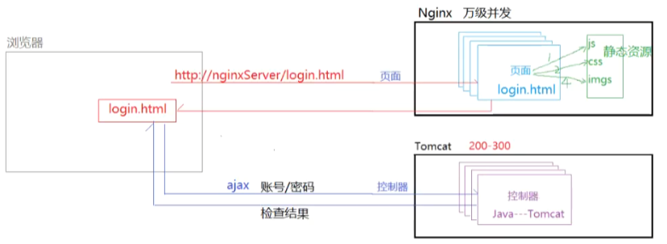
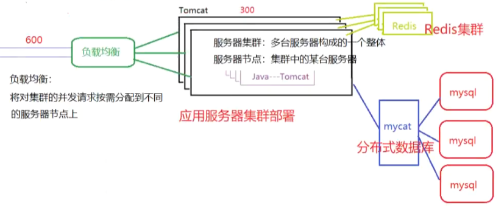
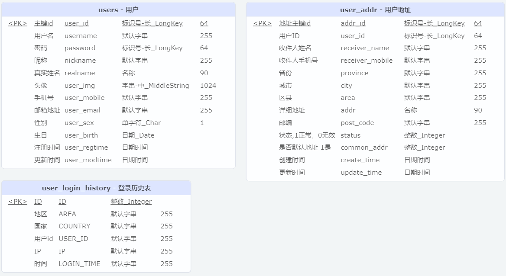
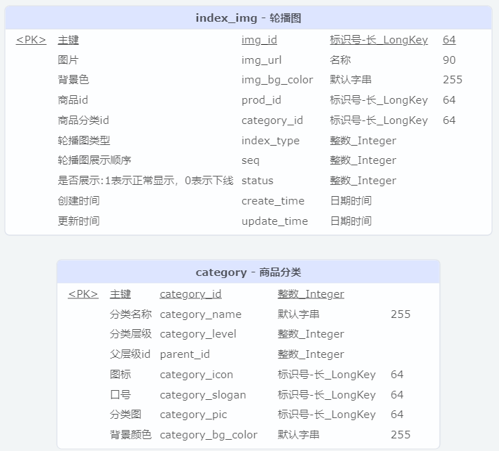
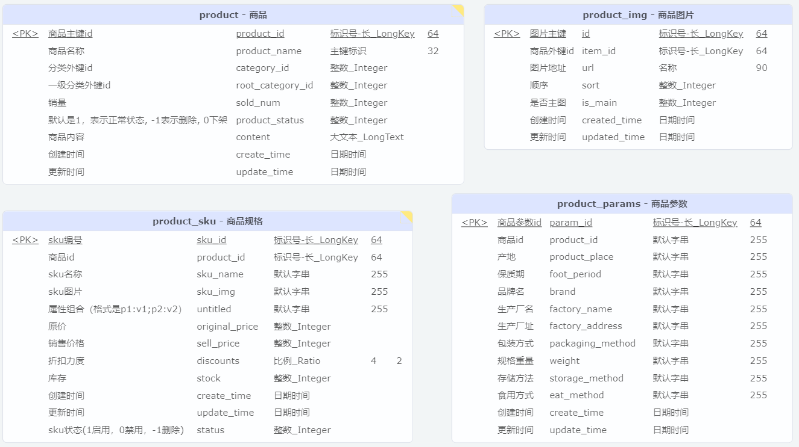
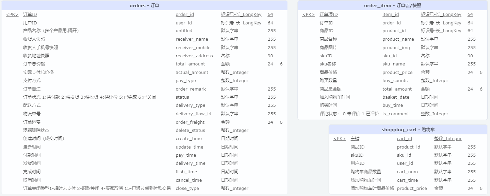
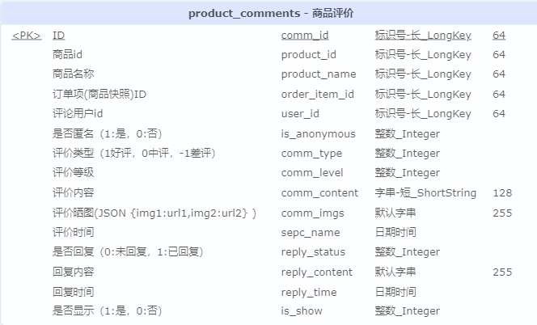

# 项目介绍

## 项目背景

一个前后端分离的B2C的电商网站。

## 技术选型

项目架构：前后端分离

前端：Vue、axios、AmazeUI、layUI、bootstrap

后端：SpringBoot整合SSM、RESTful、swagger

服务器搭建：Linux下Tomcat部署后端项目、Nginx部署前端项目

## 项目架构的演进

**单体架构 -> 前后端分离**

>  **前后端分离**是指前端页面和后端代码放在不同的服务器，与之相对的是二者放在同一台服务器上的**单体架构**，单体架构因为用户对于前后端的访问都在同一台服务器上因此会导致服务器压力大，而前后端分离架构能够解决这个问题，提高并发性。
>
> 前端对于后端某个功能/服务的访问称为**接口调用**，因此后端的一个个处理服务的控制器方法就是**接口**。



**前后端分离 -> 分布式**

> 前后端分离可以从分离对于前后端的访问的层面提升项目的并发性，然而当访问量提升到前后端分离也无法支撑时，就需要通过增加服务器节点形成集群来提升并发性。对于分布式架构来说，为了在高并发场景下保证高可用与高性能，其需要增加的模块很多：例如负载均衡、分布式锁、消息队列等。



**分布式 -> 微服务**

> 微服务也属于分布式架构，它是一种分布式架构实践方案。它主要是对于项目中的功能模块进行拆分，将一个模块抽离为一个独立工程，避免原本项目中一个模块的故障导致其他功能模块也无法使用的情况。能够提升应用的可用性。

## 项目功能

- 用户管理
  - 用户注册
  - 用户登录（cookie和session）
  - 退出登录
  - 日志管理（log4j）

# 项目搭建

## 软件开发流程

- 问题提出
- 可行性分析（技术、成本、法律可行性）
- 需求分析
- 概要设计
  - 架构设计（技术选型、架构模式、项目搭建）
  - 数据库设计
  - UI设计
  - 业务流程设计
- 详细设计
  - 业务流程的具体实现
    - 实现流程图
    - 后端接口开发
    - 前端功能实现
- 编码
  - 功能实现
  - 单元测试
- 测试
  - 集成测试
  - 功能测试
  - 性能测试
- 交付/部署实施

## 创建目录结构

```
D:.                                         
├─api --其负责对外（向前端）提供接口，接收参数并返回数据
│  ├─src
│  │  ├─main
│  │  │  ├─java
│  │  │  │  └─com
│  │  │  │      └─rybin
│  │  │  │          └─cybermall
│  │  │  └─resources
│  │  └─test
│  │      └─java
│  │          └─com
│  │              └─rybin
│  │                  └─cybermall
│  └─target
├─beans --定义用于数据存储的实体类PO
│  ├─src
│  │  ├─main
│  │  │  └─java
│  │  │      └─com
│  │  │          └─rybin
│  │  │              └─cybermall
│  │  │                  └─entity
│  │  └─test
│  │      └─java
│  │          └─com
│  │              └─rybin
│  └─target
├─common --定义工具类与通用的VO
│  ├─src
│  │  ├─main
│  │  │  └─java
│  │  │      └─com
│  │  │          └─rybin
│  │  └─test
│  │      └─java
│  │          └─com
│  │              └─rybin
│  └─target
├─mapper --其负责与数据库交互
│  ├─src
│  │  ├─main
│  │  │  ├─java
│  │  │  │  └─com
│  │  │  │      └─rybin
│  │  │  │          └─cybermall
│  │  │  │              └─mapper
│  │  │  └─resources
│  │  └─test
│  │      └─java
│  │          └─com
│  │              └─rybin
│  └─target
└─service --其负责完成业务实现
    ├─src
    │  ├─main
    │  │  └─java
    │  │      └─com
    │  │          └─rybin
    │  └─test
    │      └─java
    │          └─com
    │              └─rybin
    └─target
```

**踩坑：在测试MyBatis整合时，原本使用SpringBoot 3.2.0，和自己引入的MyBatis-spring-boot-starter 3.0.2不兼容，更换为SpringBoot 3.1.5问题即可解决。猜测如果把MyBatis换成3.0.3（当前的最新版本）应该也可以解决，但还是使用比较成熟的老版本更加稳妥。**

## 数据库设计

*用户相关表结构*



*轮播图功能相关表结构*



*商品相关表结构*



*订单相关表结构*



*商品评价表结构*



## 接口

### 接口概念

接口就是控制器中接收用户请求的控制方法，通常后端程序员需要提供接口给前端进行调用并完成相应功能。

### 接口规范

为了使得对接的前端程序员明白接口方法的如何使用，后端程序员需要编写接口规范。

> xxx后端接口说明
>
> 一、用户管理
>
> 1.1 用户登录
>
> 接口说明：接收账号和密码进行校验，并返回校验结果
>
> 请求URL：...
>
> 请求方式：GET/POST/...
>
> 请求参数：
>
> | key  | 类型   | 是否必须 | 说明         |
> | ---- | ------ | -------- | ------------ |
> | name | string | 是       | 登录的用户名 |
> | ...  | ...    | ...      | ...          |
>
> ...

### OpenAPI

**踩坑：Swagger是过去用于自动扫描接口并生成接口文档、提供对于接口的测试功能的框架，在SpringBoot2.5以前使用，现在SpringBoot3时代则变成了OpenAPI。**使用Swagger时需要的手动配置在Swagger转为OpenAPI之后由starter进行了代替，现在只需要引入如下依赖：

```xml
<dependency>
    <groupId>org.springdoc</groupId>
    <artifactId>springdoc-openapi-starter-webmvc-ui</artifactId>
    <version>2.2.0</version>
</dependency>
```

即可使用OpenAPI，无需配置也可使用。访问http://yourhost:yourpost/swagger-ui.html即可查看图形化界面的接口文档，并且在该界面开发者还能使用其提供的测试功能简便地对接口进行单元测试。

### RESTful规范

RESTful是一种接口设计规范，指导后端接口对应的URL应当如何设计。

- 每个请求路径URL唯一地代表服务器上的某个资源；

- 使用不同的请求方式表示不同的操作；

  > POST：添加资源
  >
  > GET：查询资源
  >
  > PUT：修改资源
  >
  > DELETE：删除资源
  >
  > OPTION：预检

- 接口响应的资源应当为JSON格式（或XML格式）；
- 前端通过无状态的HTTP协议与后端接口进行交互。

## MyBatis-Plus

使用MyBatis编写DAO十分机械性：首先根据数据库表创建实体类，然后创建DAO接口并编写接口中方法对应的SQL语句。

可以使用MyBatis-Plus或者tkMapper插件来简化重复编写DAO的工作。尽管这是两个不同的插件，但实现的功能大同小异，以致于学会其中一个另一个也能很快上手：提供预先编写好Mapper接口，内置了很多常用单表查询语句，我们只需要编写好接口并继承这些接口，就可以方便地使用MP提供的数据库访问操作。

> **注意：MP的MapperScan注解跟MyBatis的MapperScan注解是同一个，而要想使用tkMapper得使用其提供的MapperScan注解，从这一层面可以说MP更加贴近MyBatis。**
>
> **注意：为了让插件能自动生成SQL语句，理所当然地应该提供表名、实体类、实体类的属性与表的列名间的映射。当实体类没有用注解@TableName（因为使用MyBatis-Plus，之后的术语都是基于使用MP为前提，不同插件的注解、配置可能不同）声明对应的表名时，MP默认类名即表名；当没有使用注解声明属性对应的列名时，MP默认实体类的属性与表的列名符合驼峰命名的对应。**

### 逆向工程

MyBatis支持通过扫描数据库的表来创建实体类、Mapper、Service等文件并且能添加相应的注释与注解，对于MP需要引入如下依赖：

```xml
        <!-- MyBatis-Plus代码生成器用于逆向工程 -->
        <dependency>
            <groupId>com.baomidou</groupId>
            <artifactId>mybatis-plus-generator</artifactId>
            <version>3.4.1</version>
        </dependency>

         <!--
			逆向工程模板引擎，mp默认velocity，
			使用freemarker作为模板引擎需要显式声明
		--> 
        <dependency>
            <groupId>org.freemarker</groupId>
            <artifactId>freemarker</artifactId>
            <version>2.3.31</version>
        </dependency>
```

编写CodeGenerator及相关配置即可在指定位置产生逆向工程代码：

```java
package com.rybin.cybermall.mpconfig;

import com.baomidou.mybatisplus.annotation.IdType;
import com.baomidou.mybatisplus.core.exceptions.MybatisPlusException;
import com.baomidou.mybatisplus.core.toolkit.StringPool;
import com.baomidou.mybatisplus.core.toolkit.StringUtils;
import com.baomidou.mybatisplus.generator.AutoGenerator;
import com.baomidou.mybatisplus.generator.InjectionConfig;
import com.baomidou.mybatisplus.generator.config.*;
import com.baomidou.mybatisplus.generator.config.po.TableInfo;
import com.baomidou.mybatisplus.generator.config.rules.NamingStrategy;
import com.baomidou.mybatisplus.generator.engine.FreemarkerTemplateEngine;

import java.util.*;

public class CodeGenerator {
    /**
     * 主要
     *  mybatis-plus 代码生成器，可生成实体类，controller，service，mapper，xml文件
     * @param args arg
     */
    public static void main(String[] args) {

        // 代码生成器
        AutoGenerator mpg = new AutoGenerator();

        // 全局配置
        GlobalConfig gc = new GlobalConfig();
        String projectPath = System.getProperty("user.dir");
        gc.setOutputDir(projectPath + "\\src\\main\\java");
        System.out.println();
        gc.setAuthor("rybin"); //作者
        gc.setOpen(true); //是否打开目录
        gc.setBaseResultMap(true);//xml开启BaseResultMap
        gc.setBaseColumnList(true);//xml 开启BaseColumn
        gc.setSwagger2(false); //实体属性 Swagger2 注解
        mpg.setGlobalConfig(gc);

        // 数据源配置
        DataSourceConfig dsc = new DataSourceConfig();
        dsc.setUrl("jdbc:mysql://localhost:3306/cybermall");
        // dsc.setSchemaName("public");
        dsc.setDriverName("com.mysql.cj.jdbc.Driver");
        dsc.setUsername("root");
        dsc.setPassword("123456");
        mpg.setDataSource(dsc);

        // 包配置
        PackageConfig pc = new PackageConfig();
        //pc.setModuleName(scanner("模块名"));
        pc.setParent("com.rybin.cybermall")
                .setEntity("beans.entity")
                .setMapper("mapper")
                .setService("service")
                .setServiceImpl("service.impl")
                .setController("controller");
        mpg.setPackageInfo(pc);

        // 自定义配置
        InjectionConfig cfg = new InjectionConfig() {
            @Override
            public void initMap() {
                // to do nothing
            }
        };

        // 如果模板引擎是 freemarker
        String templatePath = "/templates/mapper.xml.ftl";
        // 如果模板引擎是 velocity
         //String templatePath = "/templates/mapper.xml.vm";

        // 自定义输出配置
        List<FileOutConfig> focList = new ArrayList<>();
        // 自定义配置会被优先输出
        focList.add(new FileOutConfig(templatePath) {
            @Override
            public String outputFile(TableInfo tableInfo) {
                // 自定义输出文件名 ， 如果你 Entity 设置了前后缀、此处注意 xml 的名称会跟着发生变化！！
                return projectPath + "/src/main/resources/mapper/" + pc.getModuleName()
                        + "/" + tableInfo.getEntityName() + "Mapper" + StringPool.DOT_XML;
            }
        });

        cfg.setFileOutConfigList(focList);
        mpg.setCfg(cfg);

        // 配置模板
        TemplateConfig templateConfig = new TemplateConfig();

        // 配置自定义输出模板
        //指定自定义模板路径，注意不要带上.ftl/.vm, 会根据使用的模板引擎自动识别
        // templateConfig.setEntity("templates/entity2.java");
        // templateConfig.setService();
        // templateConfig.setController();

        templateConfig.setXml(null);
        mpg.setTemplate(templateConfig);

        // 策略配置
        StrategyConfig strategy = new StrategyConfig();
        //数据库表映射到实体的命名策略
        strategy.setNaming(NamingStrategy.underline_to_camel);
        //数据库表字段映射到实体的命名策略
        strategy.setColumnNaming(NamingStrategy.underline_to_camel);
        //strategy.setSuperEntityClass("你自己的父类实体,没有就不用设置!");
        //lombok模型
        strategy.setEntityLombokModel(true);
        //生成RestController
        //strategy.setRestControllerStyle(true);
        // 公共父类
        //strategy.setSuperControllerClass("你自己的父类控制器,没有就不用设置!");
        // 写于父类中的公共字段
        //strategy.setSuperEntityColumns("id");
        //strategy.setInclude(scanner("表名，多个英文逗号分割").split(","));
        //strategy.setControllerMappingHyphenStyle(true);
        //表前缀
        mpg.setStrategy(strategy);
        mpg.setTemplateEngine(new FreemarkerTemplateEngine());
        mpg.execute();
    }
    public static String scanner(String tip) {
        Scanner scanner = new Scanner(System.in);
        StringBuilder help = new StringBuilder();
        help.append("请输入" + tip + "：");
        System.out.println(help.toString());
        if (scanner.hasNext()) {
            String ipt = scanner.next();
            if (StringUtils.isNotBlank(ipt)) {
                return ipt;
            }
        }
        throw new MybatisPlusException("请输入正确的" + tip + "！");
    }
}
```

**踩坑：运行该程序只需要以上依赖因此不会报错，但对于引入了MyBatis Starter依赖的SpringBoot应用可能会产生兼容性错误。这是因为MyBatis Starter包含了MyBatis的依赖，而mybatis-plus-generator依赖也包含MyBatis依赖，如果这俩依赖所包含的MyBatis版本不同，则会产生兼容性问题导致SpringBoot应用启动失败。**

## 前端功能实现

### 跨域访问问题

> 跨域访问问题：不同协议/域名/端口的应用之间的交互可能会被浏览器拦截。例如前后端分离项目中前端向后端请求的数据在发往浏览器时可能受到拦截。

后端程序员可以简单地在控制器类上加@CrossOrigin注解来解决跨域问题。

### 前端页面的传值

前端页面传值可以通过cookie或localStorage的方式实现。

- cookie是浏览器端的缓存文件，容量受到不同浏览器的限制，只能传送字符串而且没有提供系统方法来存放/取出键值对。优点在于和后端通信时能够携带cookie实现前后端沟通。
- localStorage主要用在前端页面互相传值，容量不受限制并且生命周期长，只能传送字符串但是提供了系统方法能简便地进行键值对的存放/获取。

# 开发任务

## 用户管理

### 用户登录功能

### 用户注册功能

**踩坑：当后端接口接收一个JSON串时，只能有一个形参被@RequestBody注解修饰，多个@RequestBody可能导致400错误。因为JSON串解析后将全部赋给被修饰的单个形参。**
